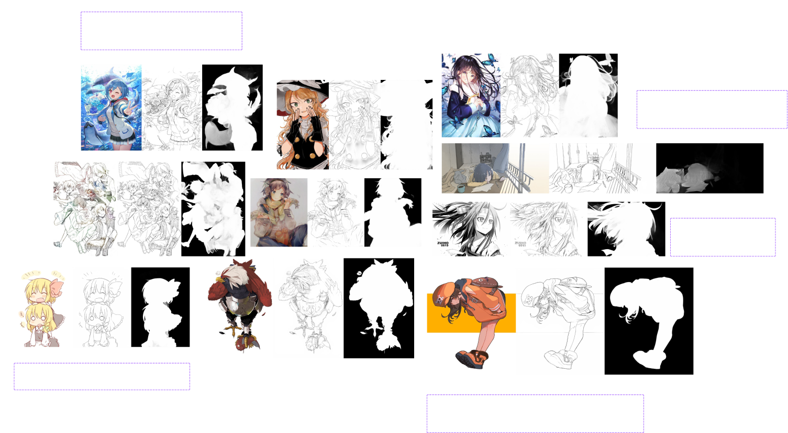
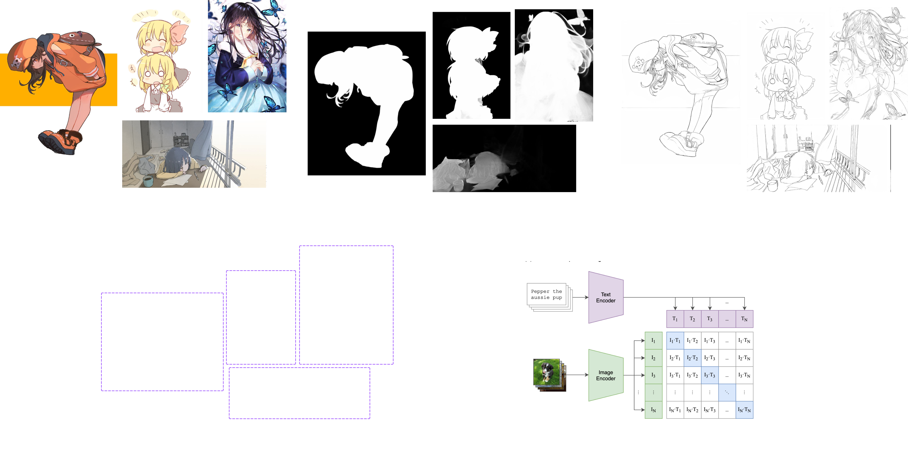
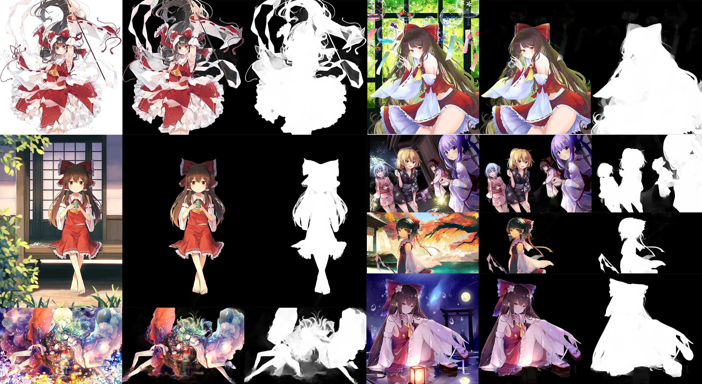
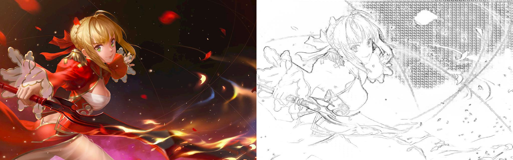
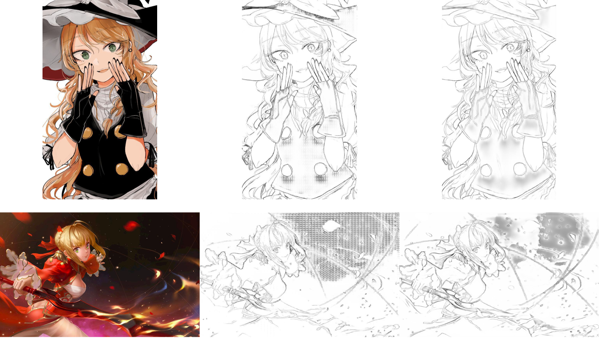

	

	Preview of the Bigbooru dataset

Previously, I've open sourced my [Animefaces 2M Dataset](/devlog/rambling/anime2m/) where I've trained various
image generation models. However, the previous dataset only contains 512x512 images of faces and also doesn't contain
any other modalities such as tags, artists, etc. The original Danbooru dataset crowd sourced tags which describes the content,
medium, artist, style, nsfw rating, etc. However, this makes the dataset only suitable for text2image tasks.

For this reason, I've decided to create a new dataset **Bigbooru**. A large scale multimodal dataset of anime illustration
which contains **3,614,514** images.

	

	Modalities supported in Bigbooru dataset

Now, let's go over each modality and how I've collected, cleaned, and preprocessed them.

## Data Cleaning and Preprocessing

Bigbooru dataset is an improved version of the original Danbooru dataset. The filtering pipeline is almost identical to the methodologies used in the [Animefaces 2M Dataset](/devlog/rambling/anime2m/).
Here's a quick summary of the filtering pipeline:

**Step 1** - Download the original Danbooru dataset from [here](https://www.gwern.net/Danbooru2021)

**Step 2** - Filter out NSFW images using rating metadata

**Step 3** - Throw out degenerate files (any files that are not .jpg, jpeg, and .png)

**Step 4** - Throw out any images with file size less than 10KB

**Step 5** - Throw out any images whose width or height is less than 256 pixels

**Step 6** - Rescale all highres images to 1024px resolution.

**Step 7** - Ensure all dimenions are multiples of 16

The last few steps were introduced to ensure that the dataset allows for easy mixed resolution training.
One weakness that many image generation models have is that they were typically trained on a single square resolution. Methods such as [ratio bucketing](https://github.com/NovelAI/novelai-aspect-ratio-bucketing)
has been proposed to alleviate this issue. Most recently, [Stable Diffusion](https://stability.ai/stable-diffusion) have also addressed this issue by conditioning the model on original image resolution, aspect ratio, and cropping coordinates.
Specifically, the decision to ensure that all dimensions are multiples of 16 was inspired by the [NaViT](https://arxiv.org/pdf/2307.06304.pdf) paper where authors propose a method to train ViT on images of arbitrary resolution.
My plans are to retrain ViT-VQGAN tokenizer on Bigbooru dataset using NaViT methodology.

## Modalities

One of the main contribution of Bigbooru dataset is the support for multiple modalities. Methods such as [ControlNet](https://github.com/lllyasviel/ControlNet) and [T2I Adpater](https://github.com/TencentARC/T2I-Adapter) has introduced an easy way of conditioning image generation models on various modalities.
I've decided to go with **depth map** and **sketches** as the additional modalities since there were already two existing models that I wanted to try out.

### Depth Map

For extrating depth map, I've used a segmentation / depth estimation model developed by [SkyTNT](https://github.com/SkyTNT/anime-segmentation) which provides quite accurate depth maps for anime illustrations.

	

	Anime2Depth model

Applying the model on the entire dataset took about 2~3 days on A100 GPU. Surprisingly, the model was robust across various art styles and forms.
For that reason, I've decided to use the model as is without any further modifications.

### Sketches

There are multiple anime sketch extraction models available online. However, I've decided to go with [Anime2Sketch](https://github.com/Mukosame/Anime2Sketch) by Mukosame.
Alternatives such as [SketchKeras](https://github.com/lllyasviel/sketchKeras) and [Ashtari et al.](https://gwern.net/doc/ai/nn/gan/2022-ashtari.pdf) were also considered but I went with Anime2Sketch since it was the easiest to use.

However, these sketch extraction models struggle with **dark** images. My hypothesis is that the model typically assumes dark pixels are part of the line. For that reason, the model struggles to distinguish between the line and the background.
Especially for Anime2Sketch, the model tends to generate grid artifacts in dark regions as shwon below.

	

	Grid artifacts for dark images

In space of image generation, grid artifacts are typically caused by the deconvolution operation. This insight was extensively discussed in wonderful (but sadly discontinued) [Distil blog](https://distill.pub/2016/deconv-checkerboard/).
Sketch2Anime model uses a unet architecture with deconvolution (a.k.a ConvTranspose2d) layers which seems to be the culprit of the grid artifacts. I replace it with a 2x bilinear upsampling layer followed by a 3x3 smoothing convolution layer + MLP layer.
The training setup is quite simple. The modified model is loaded with pretrained weights (except for modified layers) and trained to predict the original model output using L2 loss.
Training was done on a single A100 GPU for a single epoch on Bigbooru dataset. The training took less than a day and the results were quite satisfactory.

	

	Improved version of Anime2Sketch

Of course, the model predictions aren't perfect, but it significantly improves the quality of the sketches.
In addition to model improvements, I've also added CLAHE (Contrast Limited Adaptive Histogram Equalisation) preprocessing step to improve the contrast of the images.
These contributions are currently integrated into the [Anime2Sketch](https://github.com/Mukosame/Anime2Sketch) with my recent [PR](https://github.com/Mukosame/Anime2Sketch/issues/31)! 🎉

### Tags

I've also made a few minor improvements to the quality of the tags. There are also a few "junk" tags that are not very useful for image generation tasks.
These tags are abundantly present in "meta" category of tags such as `bad_pixiv_id`, `md5_mismatch`, `commentary_request`, etc.
As previously mentioned in [Animefaces 2M Dataset](/devlog/rambling/anime2m/), I also maintain a list of "unpreferred" tags such as `manga`, `comic`, `text_only`, `no_humans`, `furry`, etc.

In addition to improving tags, penultimate CLIP text embeddings were also extracted for each image using [LAION's ViT-bigG/14 model](https://huggingface.co/laion/CLIP-ViT-bigG-14-laion2B-39B-b160k).
These embeddings will be further used to train model using CFG on diffusion models.
