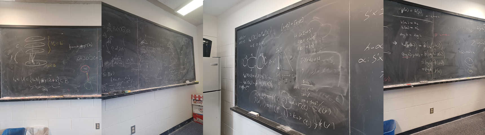
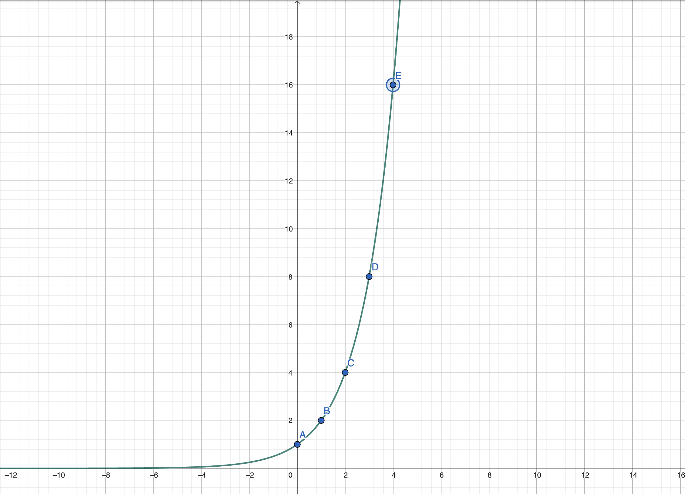

	

I miss these blackboards and smooth hagoromo chalk strokes.
	Old photos during office hours.

I've been thinking about writing about a few of my favorite theorems that I've learned during my undergraduate mathematics.
I doubt anybody reads my ramblings, but for those who do, I hope you enjoy.

## Riemann Rearrangement Theorem

Taught by Steve Gonek, Dan Geba, Carl Mueller

**Riemann's Rearrangement Theorem** states two very, very surprising facts about infinite series. Given a conditionally convergent series, it states that ...

- Rearranging the terms of the series can change the sum of the series.
- Even more shockingly, we can rearrange the terms to **any** sum we want.

These two facts are quite surprising and counterintuitive. Let's take an example to see what's going on. To recall, a conditionally convergent series is a series that converges, but does not absolutely converge.
For example, the series

$$
1 + \frac{1}{2^2} + \frac{1}{3^2} + \frac{1}{4^2} + \cdots
$$

is absolutely convergent because taking the absolute value of each term gives a convergent series. On the other hand, the series

$$
1 - \frac{1}{2} + \frac{1}{3} - \frac{1}{4} + \cdots
$$

is conditionally convergent because it converges, but the series of absolute values

$$
1 + \frac{1}{2} + \frac{1}{3} + \frac{1}{4} + \cdots
$$

is a divergent series.

What the theorem says is that for a series like $1 - \frac{1}{2} + \frac{1}{3} - \frac{1}{4} + \cdots$, rearranging the terms can change the sum of the series.
Furthemore, you can rearrange the terms in such a way that the series converges to **any sum you want**. Isn't it insane that we can do this?
The proof of this theorem is very precise and constructive. As professor Geba would say, "It's a very German proof."
The sketch of the proof is ... TODO

It's one of the few theorems that's not only surprising, but makes you question why did Riemann even thought about proving this theorem in the first place.
For a layman, you'd assume that even in the infinite case, the sums of the series are fixed no matter how you rearrange the terms.

## Art of convergence tests

Taught by Dan Geba

In most undergraduate analysis courses, the type of convergence tests that are taught are the comparison test, the ratio test, the root test, and the integral test.
The ones that ends up being most useful (in my opinion) are comparison test, root test, and ratio test.
However, there are cases where these tests yield inconclusive results.

## Vectors are not arrows

Taught by Alex Iosevich

Hoffman and Kunze's Linear Algebra book is ... not the prettiest book to first learn linear algebra from.
I still prefer Axler's Linear Algebra Done Right or generally books that combine linear algebra and its applications to ODEs.
However, one great feature about Hoffman and Kunze's book is the examples it uses to introduce vector spaces.

## Topology proof for Brouwer's fixed point theorem

Taught by Eric Hopper

## POWER series

Power series are objects that are almost too good to be true. I would like to illustrate its power (pun intended) by showing how you can use the power series to extend the definition of exponential.
When we are first introduced to the concept of exponentiation, we are told that it is repeated multiplication.

$$
e^n = e \times e \times e \times \cdots \times e
$$

Then, we are sneakly told that the graph of $e^x$ looks like this:

	

The values at integer points makes sense, they're well-defined since we know what it means to multiply a number by itself a certain number of times.
But, what does it mean to multiply a number by $\pi$ times? How does a calculator evaluate $e^x$ for non-integer values of $x$? Moreover, what would be a natural definition for $e^\pi$?
Thankfully, the power series saves the day.

$$
e^x = \sum_{n=0}^{\infty} \frac{x^n}{n!} = 1 + x + \frac{x^2}{2!} + \frac{x^3}{3!} + \cdots
$$

The power series only invovles basic arithmetic operations such as addition and multiplication, which are well-defined for any real number.
Therefore, it allows us to extend the definition of exponentiation to non-integer values very naturally.

We can push this abstraction even further by replacing $x$ with a matrix $A$.

$$
e^A = \sum_{n=0}^{\infty} \frac{A^n}{n!} = I + A + \frac{A^2}{2!} + \frac{A^3}{3!} + \cdots
$$

The

## Complex functions are really smooth

Taught by Dan Geba

## Infinite golden balls theorem

Taught by Carl Mueller

Last but not the least, I would like to mention the infinite golden balls theorem.
