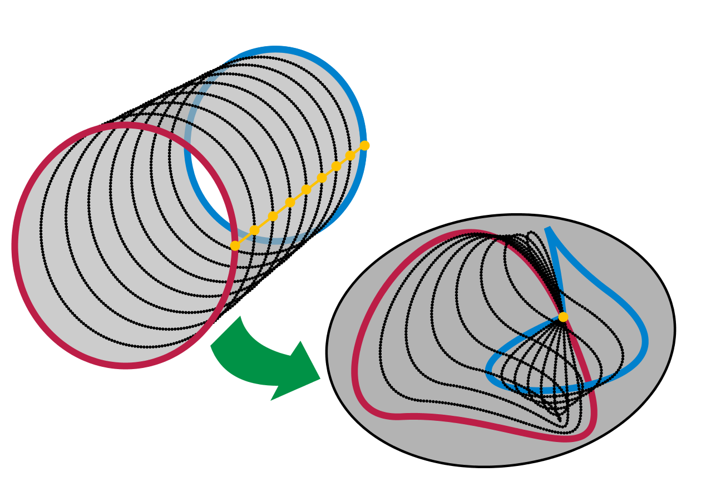

	

I miss these blackboards and smooth hagoromo chalk strokes.
	Old photos during office hours.

I've been thinking about writing about a few of my favorite theorems that I've learned during my undergraduate mathematics.
I doubt anybody reads my ramblings, but for those who do, I hope you enjoy.

## Riemann Rearrangement Theorem

Taught by Steve Gonek, Dan Geba, Carl Mueller

**Riemann's Rearrangement Theorem** states two very, very surprising facts about infinite series. Given a conditionally convergent series, it states that ...

- Rearranging the terms of the series can change the sum of the series.
- Even more shockingly, we can rearrange the terms to **any** sum we want.

These two facts are quite surprising and counterintuitive. Let's take an example to see what's going on. To recall, a conditionally convergent series is a series that converges, but does not absolutely converge.
For example, the series

$$
1 + \frac{1}{2^2} + \frac{1}{3^2} + \frac{1}{4^2} + \cdots
$$

is absolutely convergent because taking the absolute value of each term gives a convergent series. On the other hand, the series

$$
1 - \frac{1}{2} + \frac{1}{3} - \frac{1}{4} + \cdots
$$

is conditionally convergent because it converges, but the series of absolute values

$$
1 + \frac{1}{2} + \frac{1}{3} + \frac{1}{4} + \cdots
$$

is a divergent series.

What the theorem says is that for a series like $1 - \frac{1}{2} + \frac{1}{3} - \frac{1}{4} + \cdots$, rearranging the terms can change the sum of the series.
Furthemore, you can rearrange the terms in such a way that the series converges to **any sum you want**. Isn't it insane that we can do this?
The proof of this theorem is very precise and constructive. As professor Geba would say, "It's a very German proof."
The core idea of the proof is to leverage the fact that a conditionally convergent series contains both positive and negative terms. (Can you see why?)
By rearranging postive / negative terms, you can control the sum to converge to an arbitary value.

It's one of the few theorems that's not only surprising, but makes you question why did Riemann even thought about proving this theorem in the first place.
For a layman, you'd assume that even in the infinite case, the sums of the series are fixed no matter how you rearrange the terms.
Riemann's rearrangement theorem along with Stone-Weierstrass theorem were one of the first cherries on top for my early analysis classes.

## Vectors are not arrows

Taught by Alex Iosevich

Hoffman and Kunze's Linear Algebra book is ... not the prettiest book to first learn linear algebra from.
I still prefer Axler's Linear Algebra Done Right or generally books that combine linear algebra and its applications to ODEs.
However, one great feature about Hoffman and Kunze's book is the examples it uses to introduce vector spaces.

Here are some examples from the book.

**Example 1 - $n$ tuple space**

$$
(x_1, x_2, \cdots, x_n), \quad x_i \in \mathbb{F}
$$

Addition and scalar multiplication are defined as follows:

$$
\begin{aligned}
(x_1, x_2, \cdots, x_n) + (y_1, y_2, \cdots, y_n) = (x_1 + y_1, x_2 + y_2, \cdots, x_n + y_n) \\
c \cdot (x_1, x_2, \cdots, x_n) = (c x_1, c x_2, \cdots, c x_n)
\end{aligned}
$$

**Example 2 - The space of $m \times n$ matrices**

$$
M_{m \times n}(\mathbb{F}) = \{ A = (a_{ij}) \mid a_{ij} \in \mathbb{F}, 1 \leq i \leq m, 1 \leq j \leq n \}
$$

Addition and scalar multiplication are defined as follows:

$$
\begin{aligned}
A + B = (a_{ij} + b_{ij}) \\
c \cdot A = (c \cdot a_{ij})
\end{aligned}
$$

**Example 3 - the space of functions $f: X \to \mathbb{F}$**

$$
\mathcal{F}(X, \mathbb{F}) = \{ f: X \to \mathbb{F} \}
$$

Addition and scalar multiplication are defined as follows:

$$
\begin{aligned}
(f + g)(x) = f(x) + g(x) \\
(c \cdot f)(x) = c \cdot f(x)
\end{aligned}
$$

**Example 4 - The space of polynomials**

$$
\mathbb{F}[x] = \{ a_0 + a_1 x + a_2 x^2 + \cdots + a_n x^n \mid a_i \in \mathbb{F}, n \in \mathbb{N} \}
$$

Addition and scalar multiplication are defined similarly as in the previous examples.

The first example starts in a very familiar setting of $\mathbb{R}^n$. Then, it starts to ramp up the abstraction by going from $\mathbb{R}^n$ to a space of linear transformations.
The third and fourth examples provide a good bridge between linear algebra and functional analysis. When we often think of vectors, a space of functions and polynomials are not the first examples that come to mind.
While these examples are not impressive on its own, but they help us break the misconception that vectors are these pointy things in $\mathbb{R}^n$. As usual, [3b1b](https://www.youtube.com/watch?v=TgKwz5Ikpc8) has a gentle introduction on how we can think of functions and polynomials as vectors.
I should also note that operating at a higher level of abstraction also leads us to a Fourier series where you can view cosine and sine functions as an orthonormal basis of functions. Gilbert Strang has a short lecture on this topic [here](https://www.youtube.com/watch?v=vA9dfINW4Rg).

## Topology proof for Brouwer's fixed point theorem

Taught by Eric Hopper

Brouwer's fixed point theorem states that

> Every continous function from $B^2$ to $B^2$ has a fixed point.

Brouwer's fixed point has many many ways to prove it. But, I like the topology proof the most. When you first see this theorem, applying topology is not the first thing that comes to mind.
If you were to prove this theorem for 1D case, the most natural proof is to use intermediate value theorem (IVT). More formally put, if $f: [0, 1] \to [0, 1]$ is continuous, then there exists $x \in [0, 1]$ such that $f(x) = x$.
By letting $g(x) = f(x) - x$ and considering when $g(x) = 0$, one can easily use IVT to show that there exists a fixed point.

	

	
		This theorem tells me that every morning I swirl my coffee, at least one point on the surface will remain in the same place.
	

Base on this observation, it's quite natural to seek a similar analytical proof for higher dimensions. However, turns out that if you know a bit of topology, you can apply fundamental group to show that there must be a fixed point.
But, what are **fundamental groups**?

### Fundamental group and homotopy

I will give a very brief, informal introduction to fundamental groups and homotopy.
Often times when people are first introduced to topology, they are told that it's about how donuts and coffee cups are the same.
Homotopy and fundamental group is one of the way that tells us that donuts and coffee cups are the same by considering "loops" on the surface.

**Definition (Homotopy)**

Let $X$ be a topological space. Two continuous functions $f, g: X \to Y$ are called homotopic if there exists a continuous function $F: X \times [0, 1] \to Y$ such that $F(x, 0) = f(x)$ and $F(x, 1) = g(x)$ for all $x \in X$.

	

		

		

	

	
		Homotopy is a fancy way of saying that one path can be continuously deformed into another path.
	

Hence, it's natural to consider that two paths / loops that are homotopic are "the same" in some sense. In fact, one can check that homotopy is a valid equivalence relation.
Now that we've defined what it means for two objects to be "the same", now we can define how the objects can "interact" with each other.

**Definition (Fundamental group)**

Let $X$ be a topological space. The fundamental group of $X$, denoted by $\pi_1(X)$, is the set of all homotopy classes of loops in $X$ where the group operation is given by the concatenation of loops.

	

	Concatenation of loops

To make this example more concrete, let's consider an unit ball $B^2$ in $\mathbb{R}^2$.

	

	
		Loops on a unit ball can be all retracted to a point. For instance, the blue loop could be retracted to a single point by
		slowly shrinking it.
	

Therefore, the fundamental group of $B^2$ is trivial. That is to say, there's only "one" kind of loop on the unit ball.

Let's take an example of a circle $S^1$.

	

	Circle

In $S^1$, there are definately more than one kind of loops. For instance, you can go around the loop once, twice, .... as many times as you want in clockwise direction.
Moreover, you can also go around the loop in counterclockwise direction. Therefore, we can completely characterise the types of loops (i.e. fundamental group) by considering the number of times you go around the loop.
Therefore, the fundamental group of $S^1$ is $\mathbb{Z}$.

Let's take an example of a torus $T^2$.

	

	Torus

For example, on a torus, we see two ways you can go around the donut. You can go around the donut without looping through the hole, or you can go around the donut and loop through the hole.
In the figure above, we see that blue and orange loops are homotopic to each other, and similarly for the green and red loops.
By the same argument as the circle, we can completely characterise the types of loops (i.e. fundamental group) by considering the number of times you go around the loop.
Therefore, the fundamental group of $T^2$ is $\mathbb{Z} \times \mathbb{Z}$. One integer for each loop, one that goes around the donut and one that goes around the hole.

**Sketch of proof for Brouwer's fixed point theorem**

We now have a framework for characterising properties of surfaces. For contradiction, given a continous function $f: B^2 \to B^2$, suppose that $f$ has no fixed points.
Then, we can construct a mapping $F: B^2 \to S^1$ by forming a line from $f(x)$ to $x$ and taking the intersection of the line with the unit circle.

	

	Mapping $F$ takes $B^2$ to $S^1$

For the edge case when $x$ is on the unit circle, we can let $F(x) = x$. The mapping $F : B^2 \to S^1$ is a special type of mapping called a **retraction**.
It leaves the points on the unit circle fixed and pulls all the points inside the unit ball towards the unit circle.
The problem is that now you have a mapping that can continously deform a loop on $B^2$ onto a loop on $S^1$.
This causes a contradiction because we know that the fundamental group of $B^2$ is trivial (only one kind of loop), but the fundamental group of $S^1$ is not (loops are characterised by the number of times you go around the loop).

A more formal argument concludes by forming an identity map $F \circ i : S^1 \to S^1$ where $i$ is the inclusion map $i: S^1 \to B^2$.
Hence, $i$ is an injective map which implies that the fundamental group of $S^1$ will be mapped to a subgroup of fundamental group of $B^2$, which is a contradiction.

This presentation is a bit rough, but I hope the reader can see the beauty of this proof. Furthermore, the process of starting from homotopy to fundemental group is a great showcase of how mathematics is done.
After all, mathematics is all about...

**1.** Defining objects of interest.

**2.** Determining what makes these objects "equal".

**3.** Defining and studying interactions and maps between these objects.

## POWER series are POWERful

Yes, pun was intended.
Power series are objects that are almost too good to be true. I would like to illustrate its power by showing how you can use the power series to extend the definition of exponential.
When we are first introduced to the concept of exponentiation, we are told that it is repeated multiplication.

$$
e^n = e \times e \times e \times \cdots \times e
$$

Then, we are sneakly told that the graph of $e^x$ looks like this:

	

The values at integer points makes sense, they're well-defined since we know what it means to multiply a number by itself a certain number of times.
But, what does it mean to multiply a number by $\pi$ times? How does a calculator evaluate $e^x$ for non-integer values of $x$? Moreover, what would be a natural definition for $e^\pi$?
Thankfully, the power series saves the day.

$$
e^x = \sum_{n=0}^{\infty} \frac{x^n}{n!} = 1 + x + \frac{x^2}{2!} + \frac{x^3}{3!} + \cdots
$$

The power series only invovles basic arithmetic operations such as addition and multiplication, which are well-defined for any real number.
Therefore, it allows us to extend the definition of exponentiation to non-integer values very naturally.

We can push this abstraction even further by replacing $x$ with a matrix $A$.

$$
e^A = \sum_{n=0}^{\infty} \frac{A^n}{n!} = I + A + \frac{A^2}{2!} + \frac{A^3}{3!} + \cdots
$$

Exponentiation of matrices and its convergence is an important topic in ODE theory, which also reveals practical use of eigenvalues and eigenvectors.
For those who are interested in this topic, [3B1B](https://www.youtube.com/watch?v=O85OWBJ2ayo) has an excellent introduction to the topic. I also recommend [Steven Strogatz's book on nonlinear dynamics and chaos](https://www.amazon.com/Nonlinear-Dynamics-Student-Solutions-Manual/dp/0813349109).
Furthermore, power series is a core tool in complex analysis where power series of a complex function provide valueable information about the nature of the function (poles, singularities, etc.).
Another interesting application of power series is in its application to combinatorics, which I may talk about in another post.

## Infinite golden balls theorem

Taught by Carl Mueller

Last but not the least, I would like to mention the infinite golden balls theorem. This theorem is more well known as the Banach-Tarski paradox.

> A solid ball can be split into finitely many pieces and rearranged into two solid balls of the same size as the original one.

However, I like calling this theorem as the infinite golden balls theorem in honor of professor Mueller's sense of humor.
