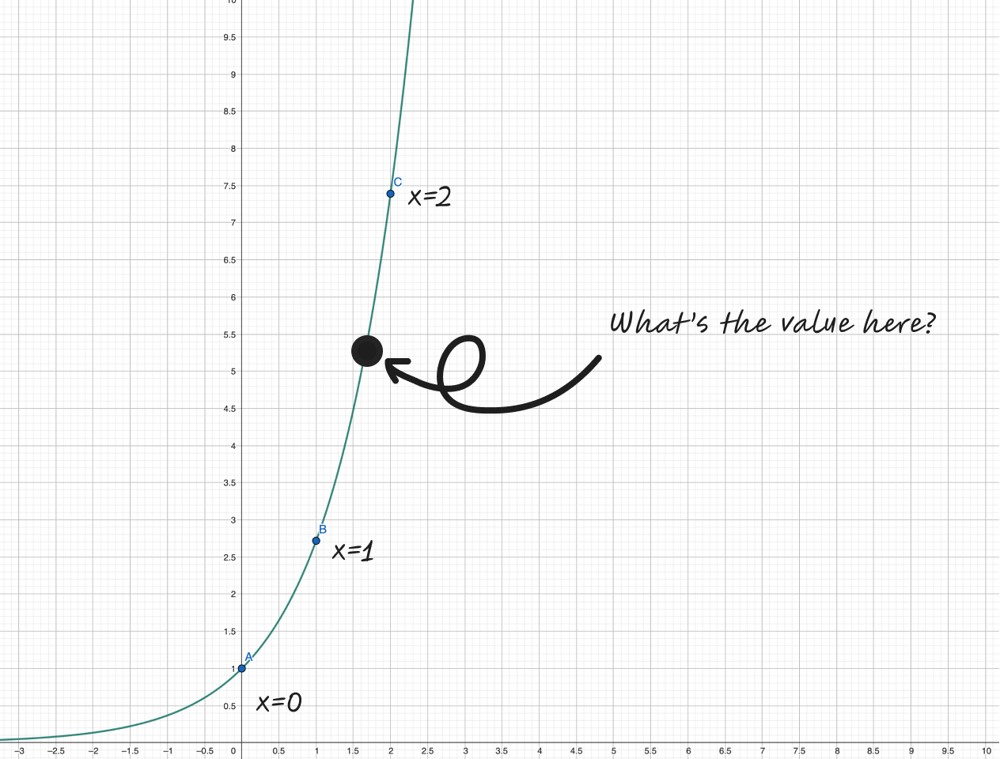

	

	I miss these blackboards and smooth hagoromo chalk strokes. Old photos during office hours.

I've been thinking about writing about a few of my favorite theorems that I've learned during my undergraduate mathematics.
I doubt anybody reads my ramblings, but for those who do, I hope you enjoy.

## Riemann Rearrangement Theorem

Taught by Steve Gonek, Dan Geba, Carl Mueller

**Riemann's Rearrangement Theorem** states two very, very surprising facts about infinite series. Given a conditionally convergent series, it states that ...

- Rearranging the terms of the series can change the sum of the series.
- Even more shockingly, we can rearrange the terms to **any** sum we want.

These two facts are quite surprising and counterintuitive. Let's take an example to see what's going on. To recall, a conditionally convergent series is a series that converges, but does not absolutely converge.
For example, the series

$$
1 + \frac{1}{2^2} + \frac{1}{3^2} + \frac{1}{4^2} + \cdots
$$

is absolutely convergent because taking the absolute value of each term gives a convergent series. On the other hand, the series

$$
1 - \frac{1}{2} + \frac{1}{3} - \frac{1}{4} + \cdots
$$

is conditionally convergent because it converges, but the series of absolute values

$$
1 + \frac{1}{2} + \frac{1}{3} + \frac{1}{4} + \cdots
$$

is a divergent series.

What the theorem says is that for a series like $1 - \frac{1}{2} + \frac{1}{3} - \frac{1}{4} + \cdots$, rearranging the terms can change the sum of the series.
Furthemore, you can rearrange the terms in such a way that the series converges to **any sum you want**. Isn't it insane that we can do this?
The proof of this theorem is very precise and constructive. As professor Geba would say, "It's a very German proof."
The core idea of the proof is to leverage the fact that a conditionally convergent series contains both positive and negative terms. (Can you see why?)
By rearranging postive / negative terms, you can control the sum to converge to an arbitary value.

	

	You can rearrange the terms to converge to any sum you want.

It's one of the few theorems that's not only surprising, but makes you question why did Riemann even thought about proving this theorem in the first place.
For a layman, you'd assume that even in the infinite case, the sums of the series are fixed no matter how you rearrange the terms.
Riemann's rearrangement theorem along with Stone-Weierstrass theorem were one of the first cherries on top for my early analysis classes.

## Vectors are not arrows

Taught by Alex Iosevich

Hoffman and Kunze's Linear Algebra book is ... not the prettiest book to first learn linear algebra from.
I still prefer Axler's Linear Algebra Done Right or generally books that combine linear algebra and its applications to ODEs.
However, one great feature about Hoffman and Kunze's book is the examples it uses to introduce vector spaces.

Here are some examples from the book.

**Example 1 - $n$ tuple space**

$$
(x_1, x_2, \cdots, x_n), \quad x_i \in \mathbb{F}
$$

Addition and scalar multiplication are defined as follows:

$$
\begin{aligned}
(x_1, x_2, \cdots, x_n) + (y_1, y_2, \cdots, y_n) = (x_1 + y_1, x_2 + y_2, \cdots, x_n + y_n) \\
c \cdot (x_1, x_2, \cdots, x_n) = (c x_1, c x_2, \cdots, c x_n)
\end{aligned}
$$

**Example 2 - The space of $m \times n$ matrices**

$$
M_{m \times n}(\mathbb{F}) = \{ A = (a_{ij}) \mid a_{ij} \in \mathbb{F}, 1 \leq i \leq m, 1 \leq j \leq n \}
$$

Addition and scalar multiplication are defined as follows:

$$
\begin{aligned}
A + B = (a_{ij} + b_{ij}) \\
c \cdot A = (c \cdot a_{ij})
\end{aligned}
$$

**Example 3 - the space of functions $f: X \to \mathbb{F}$**

$$
\mathcal{F}(X, \mathbb{F}) = \{ f: X \to \mathbb{F} \}
$$

Addition and scalar multiplication are defined as follows:

$$
\begin{aligned}
(f + g)(x) = f(x) + g(x) \\
(c \cdot f)(x) = c \cdot f(x)
\end{aligned}
$$

**Example 4 - The space of polynomials**

$$
\mathbb{F}[x] = \{ a_0 + a_1 x + a_2 x^2 + \cdots + a_n x^n \mid a_i \in \mathbb{F}, n \in \mathbb{N} \}
$$

Addition and scalar multiplication are defined similarly as in the previous examples.

The first example starts in a very familiar setting of $\mathbb{R}^n$. Then, it starts to ramp up the abstraction by going from $\mathbb{R}^n$ to a space of linear transformations.
The third and fourth examples provide a good bridge between linear algebra and functional analysis. When we often think of vectors, a space of functions and polynomials are not the first examples that come to mind.
While these examples are not impressive on its own, but they help us break the misconception that vectors are these pointy things in $\mathbb{R}^n$. 
Here's an example that can be quite illuminating. Consider the vector space of polynomials of degree at most $3$.

$$
\mathbb{R}_3[x] = \{ a_0 + a_1 x + a_2 x^2 + a_3 x^3 \mid a_i \in \mathbb{R} \}
$$

An example of a polynomial in this space would be $1 + 2x + 3x^2$, $5x^3 - 2x^2 + 1$, etc. Since $\mathbb{R}_3[x]$ is a vector space, it admits a basis. A natural basis to consider is the set of monomials $\{1, x, x^2, x^3\}$.
It's simply a fancy way of saying that we can write any polynomial in $\mathbb{R}_3[x]$ as a linear combination of the monomials. For instance,

$$
1 + 2x + 3x^2 = 1 \cdot 1 + 2 \cdot x + 3 \cdot x^2
$$

One common operation you can do with polynomials is differentiation. For instance,

$$
\frac{d}{dx}(1 + 2x + 3x^2) = 2 + 6x
$$

We also know that differentiation is a **linear** transformation since it satisfies the following properties:

$$
\frac{d}{dx}(f(x) + g(x)) = \frac{d}{dx}(f(x)) + \frac{d}{dx}(g(x))
$$

$$
\frac{d}{dx}(c \cdot f(x)) = c \cdot \frac{d}{dx}(f(x))
$$

where $c$ is a scalar.

What's great about viewing polynomials as vectors (in an abstract sense) is that we can express differentiation as a linear transformation.

$$
\frac{d}{dx}: \mathbb{R}_3[x] \to \mathbb{R}_2[x]
$$

Even better, we can represent all of these transformations as matrices. For instance, the differentiation matrix is given by

$$
\frac{d}{dx} = \begin{pmatrix}
0 & 1 & 0 & 0 \\
0 & 0 & 2 & 0 \\
0 & 0 & 0 & 3 \\
\end{pmatrix}
$$

Taking the example of $1 + 2x + 3x^2$, we can write it as a vector

$$
\begin{pmatrix}
1 \\
2 \\
3 \\
0 \\
\end{pmatrix}
$$

Applying the differentiation matrix to this vector, we get

$$
\begin{pmatrix}
0 & 1 & 0 & 0 \\
0 & 0 & 2 & 0 \\
0 & 0 & 0 & 3 \\
\end{pmatrix} \begin{pmatrix}
1 \\
2 \\
3 \\
0 \\
\end{pmatrix} = \begin{pmatrix}
2 \\
6 \\
0 \\
\end{pmatrix}
$$

which is exactly the derivative of the polynomial. What I think is quite amazing is that linear algebra tells us that if we have **any linear transformation** between finite dimentional vector spaces, we can represent it as a matrix.
You can take any abstract linear transformation and represent it as a matrix. You can use the matrix to compute its eigenvalues, eigenvectors, rank, nullity, determinant, etc. to get very concrete information about the linear transformation.

As usual, [3b1b](https://www.youtube.com/watch?v=TgKwz5Ikpc8) has a gentle introduction on how we can think of functions and polynomials as vectors.
I should also note that operating at a higher level of abstraction also leads us to a Fourier series where you can view cosine and sine functions as an orthonormal basis of functions. Gilbert Strang has a short lecture on this topic [here](https://www.youtube.com/watch?v=vA9dfINW4Rg).

## Topology proof for Brouwer's fixed point theorem

Taught by Eric Hopper

Brouwer's fixed point theorem states that

> Every continous function from $B^2$ to $B^2$ has a fixed point.

Brouwer's fixed point has many many ways to prove it. But, I like the topology proof the most. When you first see this theorem, applying topology is not the first thing that comes to mind.
If you were to prove this theorem for 1D case, the most natural proof is to use intermediate value theorem (IVT). More formally put, if $f: [0, 1] \to [0, 1]$ is continuous, then there exists $x \in [0, 1]$ such that $f(x) = x$.
By letting $g(x) = f(x) - x$ and considering when $g(x) = 0$, one can easily use IVT to show that there exists a fixed point.

	

	This theorem tells me that every morning I swirl my coffee, at least one point on the surface will remain in the same place.

Base on this observation, it's quite natural to seek a similar analytical proof for higher dimensions. However, turns out that if you know a bit of topology, you can apply fundamental group to show that there must be a fixed point.
But, what are **fundamental groups**?

### Fundamental group and homotopy

I will give a very brief, informal introduction to fundamental groups and homotopy.
Often times when people are first introduced to topology, they are told that it's about how donuts and coffee cups are the same.
Homotopy and fundamental group is one of the way that tells us that donuts and coffee cups are the same by considering "loops" on the surface.

**Definition (Homotopy)**

Let $X$ be a topological space. Two continuous functions $f, g: X \to Y$ are called homotopic if there exists a continuous function $F: X \times [0, 1] \to Y$ such that $F(x, 0) = f(x)$ and $F(x, 1) = g(x)$ for all $x \in X$.

	

	Homotopy is a fancy way of saying that one path can be continuously deformed into another path.

All that abstract nonsense above is to say that there's a way of continously deforming one path into another path.
Hence, it's natural to consider that two paths / loops that are homotopic are "the same" in some sense. In fact, one can check that homotopy is a valid equivalence relation.
Now that we've defined what it means for two objects to be "the same", now we can define how the objects can "interact" with each other.

**Definition (Fundamental group)**

Let $X$ be a topological space. The fundamental group of $X$, denoted by $\pi_1(X)$, is the set of all homotopy classes of loops in $X$ where the group operation is given by the concatenation of loops.

	

	Concatenation of loops

To make this example more concrete, let's consider an unit ball $B^2$ in $\mathbb{R}^2$.

	

	Loops on an unit ball can be all retracted to a point. For instance, the blue loop could be retracted to a single point by slowly shrinking it.

Given any closed loop on the unit ball, it's easy to see that one can continuously deform it to a point. Therefore, any (concatenation of) loops on the unit ball can be continuously deformed to a point.
Therefore, the fundamental group of $B^2$ is trivial. That is to say, there's only "one" kind of loop on the unit ball.

Let's take an example of a circle $S^1$.

	

	Circle

In $S^1$, there are definately more than one kind of loops. For instance, you can go around the loop once, twice, .... as many times as you want in clockwise direction.
Moreover, you can also go around the loop in counterclockwise direction. Therefore, we can completely characterise the types of loops (i.e. fundamental group) by considering the number of times you go around the loop.
Therefore, the fundamental group of $S^1$ is $\mathbb{Z}$.

Let's take an example of a torus $T^2$.

	

	Torus

For example, on a torus, we see two ways you can go around the donut. You can go around the donut without looping through the hole, or you can go around the donut and loop through the hole.
In the figure above, we see that blue and orange loops are homotopic to each other, and similarly for the green and red loops.
By the same argument as the circle, we can completely characterise the types of loops (i.e. fundamental group) by considering the number of times you go around the loop.
Therefore, the fundamental group of $T^2$ is $\mathbb{Z} \times \mathbb{Z}$. One integer for each loop, one that goes around the donut and one that goes around the hole.

**Sketch of proof for Brouwer's fixed point theorem**

We now have a framework for characterising properties of surfaces. For contradiction, given a continous function $f: B^2 \to B^2$, suppose that $f$ has no fixed points.
Then, we can construct a mapping $F: B^2 \to S^1$ by forming a line from $f(x)$ to $x$ and taking the intersection of the line with the unit circle.

	

	Mapping $F$ takes $B^2$ to $S^1$

For the edge case when $x$ is on the unit circle, we can let $F(x) = x$. The mapping $F : B^2 \to S^1$ is a special type of mapping called a **retraction**.
It leaves the points on the unit circle fixed and pulls all the points inside the unit ball towards the unit circle.
The problem is that now you have a mapping that can continously deform a loop on $B^2$ onto a loop on $S^1$.
This causes a contradiction because we know that the fundamental group of $B^2$ is trivial (only one kind of loop), but the fundamental group of $S^1$ is not (loops are characterised by the number of times you go around the loop).

A more formal argument concludes by forming an identity map $F \circ i : S^1 \to S^1$ where $i$ is the inclusion map $i: S^1 \to B^2$.
Hence, $i$ is an injective map which implies that the fundamental group of $S^1$ will be mapped to a subgroup of fundamental group of $B^2$, which is a contradiction.

This presentation is a bit rough, but I hope the reader can see the beauty of this proof. Furthermore, the process of starting from homotopy to fundemental group is a great showcase of how mathematics is done.
After all, mathematics is all about...

**1.** Defining objects of interest.

**2.** Determining what makes these objects "equal".

**3.** Defining and studying interactions and maps between these objects.

## Forward Backward Induction proof for AM-GM inequality

Taught by Alex Iosevich

The AM-GM inequality states that for any non-negative real numbers $a_1, a_2, \cdots, a_n$,

$$
\frac{a_1 + a_2 + \cdots + a_n}{n} \geq \sqrt[n]{a_1 a_2 \cdots a_n}
$$

For $n = 2$, the inequality is equivalent to

$$
\begin{aligned}
\frac{a_1 + a_2}{2} &\geq \sqrt{a_1 a_2} \\
\frac{a_1^2 + 2a_1 a_2 + a_2^2}{4} &\geq a_1 a_2 \\
a_1^2 + 2a_1 a_2 + a_2^2 &\geq 4a_1 a_2 \\
(a_1 - a_2)^2 &\geq 0
\end{aligned}
$$

Now, we can apply induction, but in powers of $2$. Suppose that the inequality holds for $n = 2^k$. Then,

$$
\begin{aligned}
\frac{a_1 + a_2 + \cdots + a_{2^{k+1}}}{2^{k+1}} &\geq \sqrt[2^{k+1}]{a_1 a_2 \cdots a_{2^{k+1}}} \\
\frac{\frac{a_1 + a_2 + \cdots + a_{2^k}}{2^k} + \frac{a_{2^k+1} + a_{2^k+2} + \cdots + a_{2^{k+1}}}{2^k}}{2} &\geq \sqrt[2^{k+1}]{a_1 a_2 \cdots a_{2^k} a_{2^k+1} a_{2^k+2} \cdots a_{2^{k+1}}} \\
\frac{\frac{a_1 + a_2 + \cdots + a_{2^k}}{2^k} + \frac{a_{2^k+1} + a_{2^k+2} + \cdots + a_{2^{k+1}}}{2^k}}{2} &\geq \sqrt{\sqrt[2^k]{a_1 a_2 \cdots a_{2^k}} \sqrt[2^k]{a_{2^k+1} a_{2^k+2} \cdots a_{2^{k+1}}}} \\
\end{aligned}
$$

What have we shown? We have shown that the inequality holds for $n = 2^{k+1}$ if it holds for $n = 2^k$. We know that it holds for $n = 2$ (base case).
Therefore, by induction, the inequality holds for all $n = 2^k$ for all $k \in \mathbb{N}$. But, what about other values of $n$? This is where the backward induction comes in.

Suppose that the inequality holds for $n$, let $\frac{a_1 + a_2 + \cdots + a_{n-1}}{n-1} = A$. Then,

$$
\frac{a_1 + a_2 + \cdots + a_{n-1} + A}{n} = A
$$

You can check the algebra yourself, but a simpler way to see above is that $A$ is the average of $a_1, a_2, \cdots, a_{n-1}$ and adding an average
doesn't change the mean. By hypothesis, we have

$$
\frac{a_1 + a_2 + \cdots + a_{n-1} + A}{n} = A \geq \sqrt[n]{a_1 a_2 \cdots a_{n-1} A}
$$

which is equivalent to

$$
\begin{aligned}
A^{n-1} &\geq a_1 a_2 \cdots a_{n-1} \\
A &\geq \sqrt[n-1]{a_1 a_2 \cdots a_{n-1}} \\
\frac{a_1 + a_2 + \cdots + a_{n-1}}{n-1} &\geq \sqrt[n-1]{a_1 a_2 \cdots a_{n-1}}
\end{aligned}
$$

which completes the proof $\blacksquare$.

	

	Quick illustration of forward backward induction proof.

Like any things in analysis, this proof is attributed to Cauchy. It's a good illustration of how creative you can be with induction.

## POWER series are POWERful

Taught by Dan Geba

Yes, pun was intended.
Power series are objects that are almost too good to be true. I would like to illustrate its power by showing how you can use the power series to extend the definition of exponential.
When we are first introduced to the concept of exponentiation, we are told that it is repeated multiplication.

$$
e^n = e \times e \times e \times \cdots \times e
$$

Then, we are sneakly told that the graph of $e^x$ looks like this:

	

	Graph of $e^x$. We know what $e^n$ should be, but how do we define $e^x$ for non-integer values of $x$?

The values at integer points makes sense, they're well-defined since we know what it means to multiply a number by itself a certain number of times.
But, what does it mean to multiply a number by $\pi$ times? How does a calculator evaluate $e^x$ for non-integer values of $x$? Moreover, what would be a natural definition for $e^\pi$?
Thankfully, the power series saves the day.

$$
e^x = \sum_{n=0}^{\infty} \frac{x^n}{n!} = 1 + x + \frac{x^2}{2!} + \frac{x^3}{3!} + \cdots
$$

The power series only invovles basic arithmetic operations such as addition and multiplication, which are well-defined for any real number.
Therefore, it allows us to extend the definition of exponentiation to non-integer values very naturally.

We can push this abstraction even further by replacing $x$ with a matrix $A$.

$$
e^A = \sum_{n=0}^{\infty} \frac{A^n}{n!} = I + A + \frac{A^2}{2!} + \frac{A^3}{3!} + \cdots
$$

Exponentiation of matrices and its convergence is an important topic in ODE theory, which also reveals practical use of eigenvalues and eigenvectors.
For those who are interested in this topic, [3B1B](https://www.youtube.com/watch?v=O85OWBJ2ayo) has an excellent introduction to the topic. I also recommend [Steven Strogatz's book on nonlinear dynamics and chaos](https://www.amazon.com/Nonlinear-Dynamics-Student-Solutions-Manual/dp/0813349109).
Furthermore, power series is a core tool in complex analysis where power series of a complex function provide valueable information about the nature of the function (poles, singularities, etc.).
Another interesting application of power series is in its application to combinatorics, which I may talk about in another post.

## Infinite golden balls theorem

Taught by Carl Mueller

Last but not the least, I would like to mention the infinite golden balls theorem. This theorem is more well known as the Banach-Tarski paradox.

> A solid ball can be split into finitely many pieces and rearranged into two solid balls of the same size as the original one.

However, I like calling this theorem as the infinite golden balls theorem in honor of professor Mueller's sense of humor.
Yes, you have not read it wrong. This theorem suggests that you can take a solid ball and rearrange it into two balls of the same size as the original one.

	

	You can split a solid ball into finitely many pieces and rearrange it into two solid balls of the same size as the original one.

I believe that the best explanation for this theorem is one covered by [VSauce](https://www.youtube.com/watch?v=s86-Z-CbaHA) which I watched a while back.
This paradox also serves as an excellent example of why we care about measure theory, which is a branch of mathematics that deals with "size" of sets.

## Many many other interesting theorems

There are other interesting theorems and proofs that I did not cover here. A few of them are listed below.

### Many proofs of fundamental theorem of algebra
Not necessarily because the result is important, but because this theorem has many proofs ranging from complex analysis, topology, and abstract algebra.
Also, fundemental theorem of algebra is one of the "facts" that are often brushed under the rug in high school mathematics.

### Generalised Stokes' theorem
Ironically, I learned the generalised Stokes' theorem before learning... the regular Stokes' theorem. (We used Spivak's Calculus on Manifolds, which is not a very kind book to learn from. I still think his grey calculus book is his best work.)
Generalised Stokes' theorem unifies Green's theorem, divergence theorem, and Stoke's theorem into a simple statement.

$$
\int_S d\omega = \int_{\partial S} \omega
$$

Generalised Stokes' theorem is an example where the result and the proof is "simple" once you set up the right set of abstractions.
Most of Spivak's book is spent on setting up differential forms, wedge product, and exterior derivative. Once these are set up, the proof itself is quite minimalistic.

### All cows are black

Did you know that [all cows are black](https://en.wikipedia.org/wiki/All_horses_are_the_same_color)?

### Many ways of integrating a function

- Darboux Integral
- Riemann Integral
- Riemann-Stieltjes Integral
- Lebesgue Integral

These are the four most common ways of integrating a function, of which the first two are actually equivalent. Lebesgue integral ends up being the most general one and covers cases that the other three cannot.

### Vacous truth

I've always found vacous truth to be quite amusing. The statement "All cats in this room are black" is vacous because there are no cats in this room.
Nonetheless, it is a true statement.

### Mathematicians do not know how to name things

While taking my topology class, I learned that mathematicians do not know how to name things.
The canonical example is "open" and "closed" sets. A set can be both open and closed, which we call a "clopen" set (I know, I know).
If a set is NOT open, it doesn't imply that it's closed, and vice versa.

Furthermore, we have a hierachy of topological spaces based on how "separable" the subsets of that topological space are.
For instance, $T_2$ is called a Hausdorff space, which is a space where any two distinct points can be separated by disjoint open sets.

	

	Hausdorff space allows us to separate any two distinct points by disjoint open sets.

One might expect that we would have $T_1, T_2, T_3, \cdots$... but we don't.

	

	Kolmogorov Classification of topological spaces. The more "separable" the space is, the higher the number.

### $\epsilon, \delta$ proofs

$\epsilon$, $\delta$ proofs, and field axioms were one of the first "rigorous" introduction to analysis, and maybe the first time you see a rigorous proof in your first analysis class.
For a highschool student who's dissatisfied with the "black magic" treatment of limits in calculus, $\epsilon$, $\delta$ proofs served me as a good illustration of how you can set up the right abstraction to rigorously "prove" mathematical statements without relying on graphics and hand waving alone.
I thank Professor Haessig for introducing me to $\epsilon$, $\delta$, and in large, encouraging me to do more mathematics during my undergraduate years.