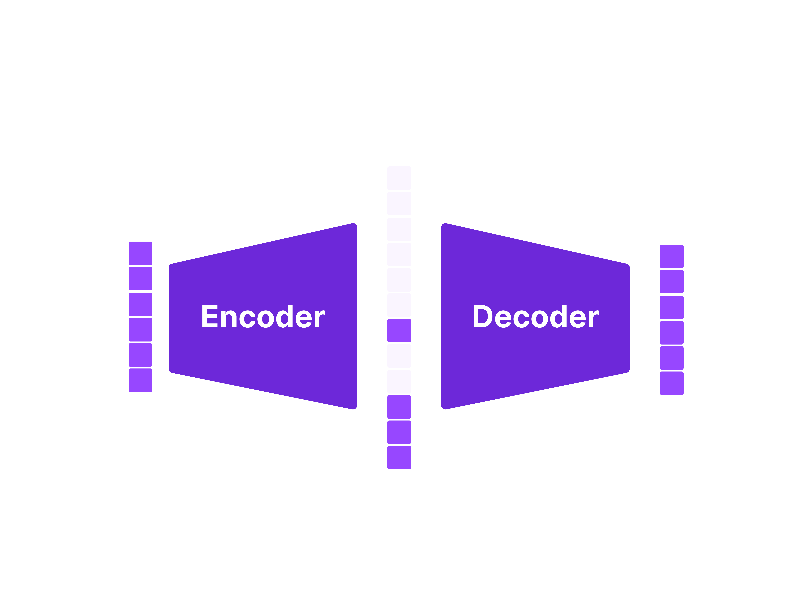
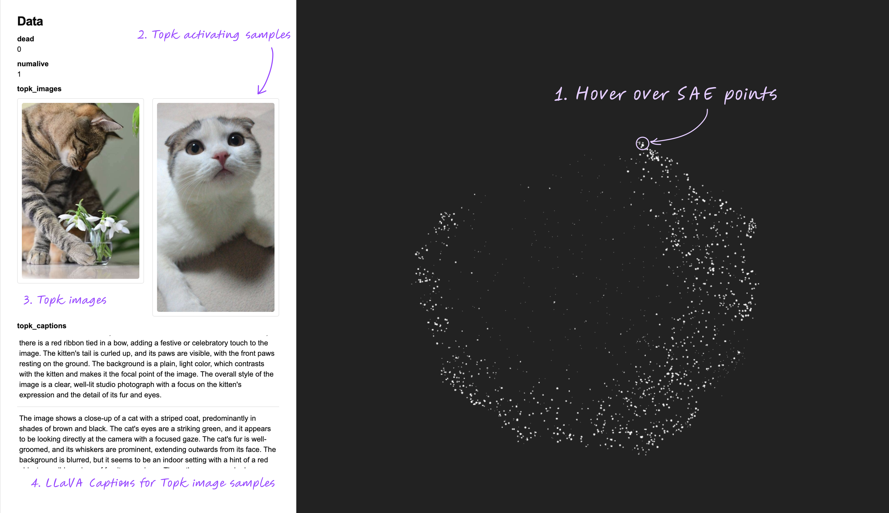
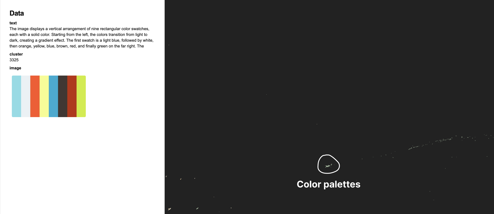
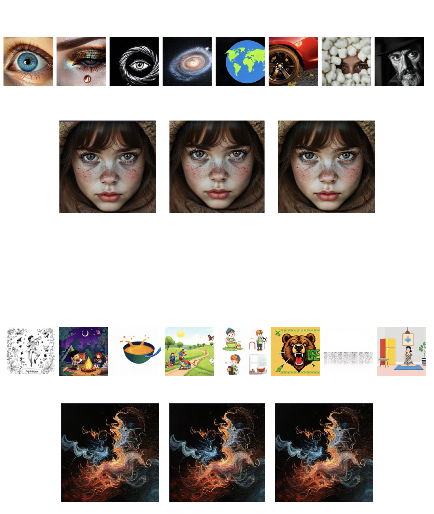

	

	You can access [fluxlens](https://fluxlens.vercel.app) to explore the features of Sparse Autoencoders.

## Preface

Over the years, ML researchers have burned countless hours training large neural networks.
However, its inner workings remain opaque and incomprehensible to humans.
There have been many research efforts in the past [[1](https://distill.pub/2017/feature-visualization/)] [[2](https://distill.pub/2019/activation-atlas/)] introspect what happens inside neural networks.
Most recently, Sparse Autoencoders have shown to be a promising tool in analysing Large Language Model's behavior.

This work explores how Sparse Autoencoders (SAE) can be applied to diffusion models and vision encoders.
We demonstrate that SAEs can be used to decompose model's activation space into interpretable, semantic components.
Furthermore, to the best of our knowledge, we are the first to show that SAEs trained directly on flow matching models (`flux`).
This work is accompanied by `fluxlens`, a minimal visualisation tool I've built to explore SAE features and multimodal datasets.

This work began early October in collaboration with [krea.ai](www.krea.ai) who've dragged me out of GPU poverty line. The initial exploration and visualisation tool was built on top of krea's internal assets. However, to facilitate SAE open research efforts, I've retrained SAEs on public multimodal dataset (CC3M).
The code for SAE training will be open sourced in the coming weeks.

I'd also like to acknowledge that this work was directly influenced by [Antrhopic's SAE work](https://transformer-circuits.pub/2023/monosemantic-features) and [Transformers Circuit discourse](https://transformer-circuits.pub/).
A fair amount of SAE implementation was referenced from [saprmarks's dictionary learning codebase](https://github.com/saprmarks/dictionary_learning) and [OpenAI's implementation](https://github.com/openai/sparse_autoencoder).
Among other resources, I've found [Linus's prism](https://thesephist.com/posts/prism/) , [Gytis Daujotas](https://www.lesswrong.com/posts/Quqekpvx8BGMMcaem/interpreting-and-steering-features-in-images)'s and [hugofry](https://www.lesswrong.com/posts/bCtbuWraqYTDtuARg/towards-multimodal-interpretability-learning-sparse-2) 's post on LessWrong an useful reference for training SAEs and vision SAEs in particular.

## Background

Generative models such as GPTs and Stable Diffusion has changed the information landscape in just couple of years.
However, it's not at all clear how these massively large matrix multiplications generate its output. 
Neurologists have been facing similar challenges on a different subject, the brain. A classical way to study the brain is to provide a wide range of stimulus and see which part of the brain "lights up" using a fMRI.

Similarly, with neural networks, we can feed it a wide range of data and see what part of neurons gets "activated".
In CNNs, this task is a bit easier since one can directly look at the CNN kernels (i.e. filters).

	

	Filters learned from AlexNet - [Source](https://cs231n.github.io/convolutional-networks/)

Feeding in bunch of data to the model and collecting statistics on where model gets activated is a viable idea. However, it is often the case that **multiple parts** of the models fire up given a single image. This behavior makes it inherently hard to dissect what individual components of the model focuses on.

One of the earliest solution to this problem was "DeepDream" flips the problem. Instead of **feeding data** which fires specific parts of the model. You can **optimize the data** to maximally activate a specific part of the model.

	

	Source: Distil.pub

  

Early works in interpretability research mainly focused on ImageNet pretrained models and mutlimodal models such as CLIP. But, as large language models became a more attractive specimen, interpretability researchers got naturally interested in applying these techniques to LLMs. 

**Polysemanticity** is a phenomenon where a "single neuron" gets activated by mixture of different concepts (semantics). For instance, a neuron could get excited by a "human face, front of cars, and cat's back". Ideally, we'd some kind of method to separate these concepts. This is where Sparse Autoencoders (SAE) come in.

Sparse Autoencoder, also known as dictionary learning is a [classical method](https://scikit-learn.org/1.5/modules/generated/sklearn.decomposition.DictionaryLearning.html) to learn a dictionary which sparsely encodes the data.
In practice, SAEs are trained by a shallow neural network with a single encoder / decoder.

	

	Sparse Autoencoder architecture

  

A well-trained SAE has the following features
- It can accurately reconstruct its input
- A very small number of hidden states have non-negative values.

The first objective is easily achieved with a standard reconstruction loss.
The second objective is typically achieved with a `ReLU` activation to threshold negative values and adding a sparsity penalty.

	

	SAE with ReLU activation and sparsity penalty

It's still unclear at this point why SAEs are useful for decomposing a single feature vector.
But, if you think about what SAE is doing in terms of matrix multiplication, it becomes quite clear.

	

	Matrix multiplication view of SAE decomposition

Multiplying a sparsely activated hidden feature is equivalent to taking a weighted average over a small subset of decoder matrix columns.
In other words, one can think of columns of the decoder matrix as a "dictionary".
One parallel I would like to draw here is that MLP blocks and GLU blocks found in large transformer models can be thought as [SAE](https://www.youtube.com/watch?v=9-Jl0dxWQs8) as beautifully put by Grant Sanderson.

Another key advantage of SAE with generative model is that once you identify what each of the SAE features' semantics, one can simply "boost" this feature to guide the model's generation as seen with [Golden Gate Claude](https://www.anthropic.com/news/golden-gate-claude).

	

	Steering model generation by boosting SAE features

Sadly, interpreting SAE feature is still a somewhat manual process. Most common interpretability strategy is:
- Run the base model + SAE on the training dataset.
- Identify top-k activating samples from the dataset.
- Manually eye-balling the samples or prompt `gpt-4o` to generate explanations given samples.

Now that we've laid the foundation for SAEs let's go into the details.

## Training Sparse Autoencoders

When it comes to training SAEs, there are two metrics we need to focus on:
- **L0** - Number of average activated SAE features. This measures how well the sparsity condition is satisfied.
- **L2** - Reconstruction error - How well the SAE reconstructs the input.

In summary, _the best SAEs are those that can accurately reconstruct the input using minimal number of dictionary features._
The architecture that I've explained in the previous section is a standard SAE implementation used by Anthropic team.
Since then, multiple variants of SAEs have emerged. The variants I've tested are [Gated SAE](https://arxiv.org/abs/2404.16014), [JumpReLU SAE](https://arxiv.org/abs/2407.14435), and [Topk SAE](https://cdn.openai.com/papers/sparse-autoencoders.pdf). 
In the end, I've ended up using Topk SAEs because these variants allow you to explicitly set desired `L0` (i.e. $k$) value.
Furthmore, Topk SAEs come with the benefit that you don't have to tune spacity loss weight $\lambda$ as it is done in standard, Gated, and JumpReLU SAEs.

	

	Hyperparameter sweep results for SAE variants

After running a sweeps on learning rate, $\lambda$, and $k$ values across different values, I've found that TopK SAEs to be most performant and robust across different configurations.

## Training configuration

- Dataset: [CC3M + LLaVA Recaptioning](https://huggingface.co/datasets/lmms-lab/LLaVA-ReCap-CC3M)
- CLIP : [CLIP ViT-L/14](https://huggingface.co/openai/clip-vit-large-patch14)
- FLUX: [FLUX.1.schnell](https://huggingface.co/black-forest-labs/FLUX.1-schnell)

[hugofry](https://www.lesswrong.com/posts/bCtbuWraqYTDtuARg/towards-multimodal-interpretability-learning-sparse-2) has previously trained a SAE on CLIP vision encoder on ImageNet dataset.
To expand on their work, I've decided to use CC3M dataset with LLaVA recaptioning to train SAEs on CLIP vision/text encoder.
For vision encoder, CLS token was sampled from penultimate layer of CLIP vision encoder. For text encoder, text pooled output was used as input to the SAE.
To make training faster, I cached the activations onto `.safetensors` format to avoid recomputing activations.

As for FLUX.1.schnell, I've used the same training setup as CLIP SAEs. I've sampled activations from the output of following locations at first time step:

- single_transformer_blocks.37
- single_transformer_blocks.9
- transformer_blocks.0 (text stream)
- transformer_blocks.0 (image stream)
- transformer_blocks.18 (text stream)
- transformer_blocks.18 (image stream)

For FLUX SAEs, the activations were generated on the fly by using CC3M prompts to generate images. Motivated by [Ostris's finding on skipping FLUX blocks](https://ostris.com/2024/09/07/skipping-flux-1-dev-blocks/),
I thought it'd be interesting to train SAEs on early, middle, and late layers of the model. We only train on activations sampled from first denoising step because `FLUX.1.schnell` tends to converge on its content, style, and composition extremely quickly.
We generate images using standard FLUX.1.schnell sampling pipeline with base resolution 256x256.

### Notes on training (Optional)

It should be taken with a grain of salt that I did not implement "all" the tricks that were used in Gated / JumpReLU SAEs.
To keep my implementation simple, I intentionally avoided using techniques such as:

- Ghost grads
- Neuron resampling
- Auxiliary loss on TopK SAEs
- etc.

However, a few techniques I've used were:

- Tied decoder weights on initialisation
- Unit norm constraint on decoder weights (normalise column to unit length after each update)

For Topk SAEs, I use a learning rate of `3e-4` with the `AdamW` defaults. I didn't see noticible boost by setting $\beta_0 = 0$.
Effective batch size was set to `8192`. SAEs were trained for 6 ~ 12 epochs on 8 A100 GPUs. DDP + bf16 mixed precision was used to speed up training.
I've used `k = 4,16,32,64,128` to control for `L0`.

## Visualising SAEs and Multimodal dataset

Visualising dataset is always a joyful activity. I wanted to develop a minimal interface to explore the dataset itself and the features learned by SAEs.
Over a weekend, I built `fluxlens`, a minimal visualisation tool to explore SAE features and multimodal datasets.
The points are rendered using nomic's open source `deepscatter` engine. I use `cuml`'s CUDA implementation of UMAP and HDBSCAN to for effiicient clustering and dimensionality reduction.

	

	Quick tour of SAE explorer interface

	

	[CC3M dataset visualisation](https://fluxlens.vercel.app)

## Interesting defects in CC3M dataset

	

	Near duplicate newspaper images

	

	Color palette images

	

	404 images

## Examples of CLIP SAE feature visualisation

For CLIP vision / text encoders the results were quite promising.

	

	Houses SAE features

	

	Drinks SAE features

	

	Dance SAE features

## Examples of FLUX SAE feature visualisation

I've found that SAEs trained on the lower stream of FLUX model `transformer_blocks.0` were significantly harder to interpret compared to later layers.
The later layers such as `single_transformer_blocks.37` seemed to have slightly more interpretable features. Below are a few examples of features visualised from FLUX SAEs on `single_transformer_blocks.37`.

	

	Natural road SAE features

	

	Text SAE features

These features are significantly less interpretable than CLIP features. I hypothesize that this is due to the fact that
- CLIP is inherently trained to semantically align vision features with text features.
- Unlike autoregressive models, FLUX is a flow matching model which predicts "change" in the content rather than the content itself.

## Preliminary Steering results

After extracting these SAE features, I tried steering the model using the identified features. 
I tried steering the generation using both CLIP SAE features and FLUX SAE features, but the results were not as promising as I had hoped.

	

	Steering results using FLUX SAE features

This result was a bit unexpected since [Gytis](https://www.lesswrong.com/posts/Quqekpvx8BGMMcaem/interpreting-and-steering-features-in-images) had previously shown that steering works well with CLIP SAEs on Kandinsky 2.2 models.
You can try to increase steering strength even more, but I found that it starts to break the generation or make the images extremely bright.
However, I was overall happy with the visualisation results and CLIP SAEs that I've trained. As for the reason why steering didn't work as well, it could be several reasons:

### Possible reasons for steering failure

    
        CLIP has relatively minimal impact on generation content.
    
    I've abalated effects of CLIP on 6~8 different images by setting CLIP features to zero. At least on first glance, the generated images did not seem to change much.
    Of course, this observation is on a handful of images, so it might not be conclusive.

    
        FLUX is a flow matching model.
    
    At the end of the day, FLUX is a flow matching model, not an autoregressive model which predicts the image directly. 
     [Gytis](https://www.lesswrong.com/posts/Quqekpvx8BGMMcaem/interpreting-and-steering-features-in-images)'s result serves as a counterpoint to this hypothesis, but Kandinsky 2.2's training receipe is quite different from FLUX.
    It might be more interesting to apply SAE steering techniques to image generation models such as [HART](https://github.com/mit-han-lab/hart), [MAR](https://arxiv.org/abs/2406.11838v1), and [Lumina](https://github.com/Alpha-VLLM/Lumina-mGPT).

    
        I'm very dumb and my steering implementation is flawed (quite likely).
    
    I might have made a mistake in my steering implementation. In that case, I would love to hear feedback from the community.
    If you have any insights and would like to dive into the code, details, or anything else, please reach out!
    I'm available via [twitter](https://x.com/sleenyre) / [email](mailto:sangwulee2@gmail.com) / ... etc.

## Future directions

Of course, there are a few unturned stones that I would like to explore in the future:

- Is there a method to brute force find steering vector instead of training an SAE? This method would allow me to reverse engineer criterion of an ideal steering vector.
- Can we apply SAEs on VAEs directly?
- Applying SAEs on alternative image generation architectures such as HART, MAR, and Lumina.
- Training SAEs on T5-XXL
- Trying out different locations to sample activations from FLUX.

One experimental idea I have is to simply take a few hundred images with a distinct style, sample activations from FLUX, and simply run a SVD/PCA and use the resulting components as steering vectors.
Obvisouly, there's the task of adding extra UI componetns to `fluxlens` to allow users to steer generations on the sight. Ideally, I should try to make it as feature-complete as possible like [Neuronpedia](https://www.neuronpedia.org/).