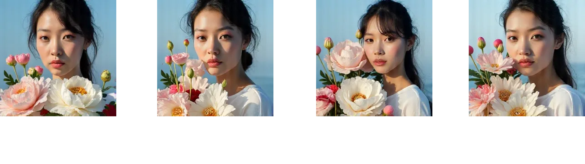

import { Image } from "astro:assets"

    
    
Linear interpolation of hairbun vector from $0$ ~ $24$

## Overview

In my [last SAE post](/devlog/rambling/sae), I've experimentd by training SAEs on CLIP and flux block activation outputs.
While the results and visualisation demonstrated the potential of SAEs, steering with SAE seemed quite ineffective.

However, a couple months ago, black forest labs team relased [redux](https://huggingface.co/black-forest-labs/FLUX.1-Redux-dev), a version of flux conditioned on SigLIP vision embeddings.

    
    
 flux redux allows users to condition the model on an image, allowing users to create variations - [source](https://blackforestlabs.ai/flux-1-tools/)

I qucikly found that redux is **heavily** conditioned on the input image, making it a prime candidate for steering with SAEs.
Redux fulfilled two criterias that were missing in my previous experiments:

<h3>Strong steerability</h3>

CLIP SAEs had highly interpretable, well-defined steering vectors. However, CLIP embeddings have a weak effect in controlling flux generations.

<h3> Interpretable steering vectors</h3>

flux SAEs have a strong potential to guide flux generations, its outputs are not semantically interpretable. CLIP embeddings are by design trained to align with language semantics, making it easier to understand what each steering vector is controlling. 
However, flux models are trained using flow matching objective which doesn't have these constraints.

Before we dive into the results, let's first understand how redux works.

## How does flux redux work?

To refresh our memory, flux is a MMDiT model. At a high level, MMDiT block takes text + image embeddings as a single sequence and processes them through a bidirectional transformer.
This architecture is in contrast to conditioning via crossattention which have been used since SD - SDXL variants.

    
    
 Simplified schematic of flux architecture. flux has two variants of MMDiT blocks, a double stream block which processes text and image embeddings in parallel and a single stream block which processes text and image embeddings as a single sequence.

There are countless ways to inject conditioning information into model (post for another day), but redux chooses a simple yet effective approach.

    
    
 Conditioning with SigLIP embeddings in flux redux

In redux, SigLIP embeddings are projected using a light MLP layer and concatencated together with text embeddings. Past this point, the text + siglip embeddings are treated as a single text embedding sequence and processed through the MMDiT block.

    
    
 Fuyu architecture - [source](https://www.adept.ai/blog/fuyu-8b)

Afterwards, the good old attention mechanism kicks in and conditions the image embeddings on siglip embeddings.
One should note that this is a commonly known pattern found in multimodal transformers, dating back to early works like [VisualBERT](https://arxiv.org/abs/1908.03557) going all the way to recent works like [LLaVA](https://github.com/haotian-liu/LLaVA), [Fuyu](https://www.adept.ai/blog/fuyu-8b), [Idefics3](https://huggingface.co/papers/2408.12637), [Molmo](https://molmo.allenai.org/blog), etc.
There is a discussion around whether using patch embeddings / pretrained image embeddings is more effective, but that's out of scope for this post.

## Steering with SigLIP SAE

Using Topk SAE on CC3M dataset, I was able to train a TopK SAE on SigLIP embeddings. Specifically, I train SAE on `.last_hidden_state` embeddings on `google/siglip-so400m-patch14-384` model.
The SigLIP SAE is available [here](https://fluxlens.vercel.app/sae/long/cc3m-siglip-vision-topk-lr-3e-4-k-16-expansion-4-acts). For details on the training recipe, refer to the [previous post](/devlog/rambling/sae).

    
    
 Annotated interface for SigLIP SAE - [source](https://fluxlens.vercel.app/sae/long/cc3m-siglip-vision-topk-lr-3e-4-k-16-expansion-4-acts)

Let's see how we can use the SigLIP SAE to steer flux generations.
We can use this lovely image from [krea.ai](https://krea.ai/) as an input image.
Since SigLIP partitions an image into 27x27 patches, we can apply SAE on each patch embedding to see what steering vectors are present in each patch.

    

We quickly discover that there are two predominant steering vectors in the image: a hairbun vector and white flower vector.
After looking up these vectors in the SAE, we can verify that these vectors are indeed hairbun and white flower vectors by inspecting the top activting samples.

    
    
 The colored patch represents the strength of the steering vector in the patch

By feeding the SigLIP embedding of the above image to flux redux, we can steer the generation by increasing the strength of each steering vector.
Note that we increase the strength of the steering vector on **all** patches.

    
    
 Steering with SigLIP SAE + flux redux

Seems quite effective! However, one small thing we notice is that while steering works fairly well, we notice that is starts to have a noticeable "grid" artifacts.
This phenomenon is quite likely due to the fact that steering is too strong, making the embedding out of distribution.
So making a combination of "concepts" more prevalent is possible. What above suppressing a concept?
We can actually "clamp" the value of feature vectors to 0, dampening the effect of the steering vector.

    
    
 Suppressing concepts by clamping the feature vector

We see that by clamping the hairbun vector, we can make the subject "untie" her hairbun or make white flower less prevalent in the image.
I've also found that setting the feature vector to negative values were also quite effective in suppressing the concept.

    

        
        
 Suppressing concepts by setting the feature vector to negative values

    

The use case for SAE based concept editing is not limited to manipulating existing concepts. If you find an interesting steering vector in the SAE, you can use these to "introduce new concepts" to the image.

    
    
 Introducing new concepts by increasing the strength of the feature vector

In my last manual exploration, I wasn't able to find a distinctive "style" vector within CC3M SAE. A huge majority of SAE steering vectors seem to be related to objects, scene, texture, etc.
Perhaps, I should try training an SAE on something like LAION-art / LAION-aesthetic subset for finding steerable style vectors.
One interesting observation is that due to the fact that so many CC3M images are sourced from getty images, I even found a "getty images watermark" vector. And yes, I found one for Alamay as well.

    
    
 Getty images watermark vector

Using these features, we can easily compose images with different concepts at the same time.

    

        
        
 Composing images with different concepts

    

## Thoughts on SAE based image editing

Am I bullish on steering with SAEs? Yes and no. I'm quite bullish on SAEs for **(1) finding sparse interpretable features for CLIP/LLMs** and **(2) interpretability tool for understanding semantics prevalent in each layer**.
Even for data visualisation, SAEs are quite useful as a **hyperspecific clustering algorithm** to discover distinctive samples in the dataset.
But, SAEs are still experimental when it comes to image editing tasks. Diffusion and flow matching models fundementally operate in a different embedding space compared to CLIP/LLMs.
I have still yet to find an effective way to steer flux generations directly, instead of relying on conditioning models like redux.
One idea that I'd like to advocate is to try training SAE on a single-step distilled version so that the diffusion models operates similar to LLMs which directly predict the output.
Another option would be to try SAE steering on AR image generation models such as MAR, VAR, and Lumnia-mGPT.

Furthermore, SAE has many computational benefits compared to SFT with LoRA for diffusion model finetuning. 
Unlike LoRAs, SAE based style adaption is an one-time operation and yields thousands of composable, steerable vectors after a single training.
For adapting to a single style / subject, standard LoRA training will be more effective. But, operating on activation space without altering model weights leaves room for localised, composable edits.

Lastly, having a linearly disentagled feature space is a powerful tool.
In the [StyleGAN](https://arxiv.org/abs/1812.04948) era, we have seen how beneficial it is to have a [semantically disentagled feature space](https://arxiv.org/abs/2103.17249) for editing and blending images.
Many of the classicial latent interploation, editing, blending, and inversion techniques that inspire editing methods in diffusion models were explored in the GAN times.
I think SAEs have the potential to really open up these possibilities once a few key components are in place.

## Future steps

As usual, I plan on **(1) open sourcing the implementation and weights**. Another plan is to have an **(2) interactive demo** and a colab notebook for users to experiment with steering themselves.
As for technical improvments there a few low hanging fruits like **(3) training SAE on more "stylistic" datasets** and **(4) reducing grid artifacts**.
Hopefully, I will get to these sometime soon. But, there is only 24 hours in a day.

