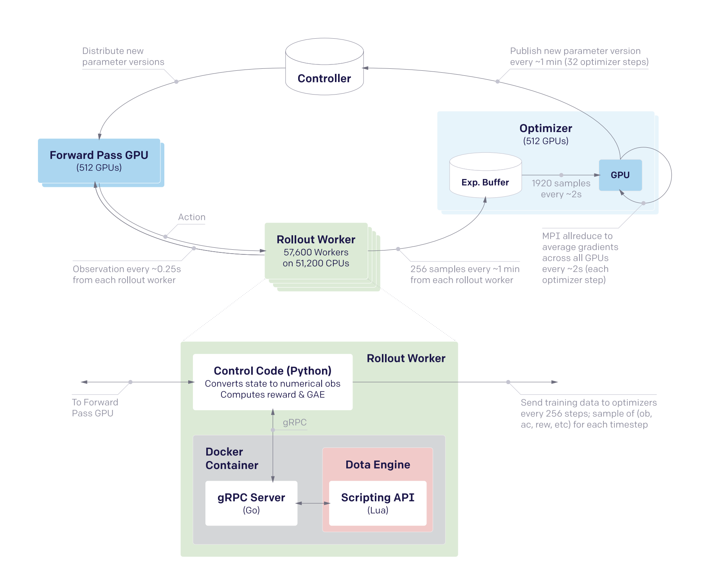
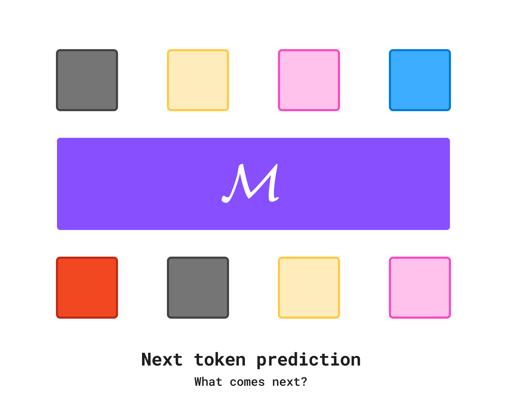
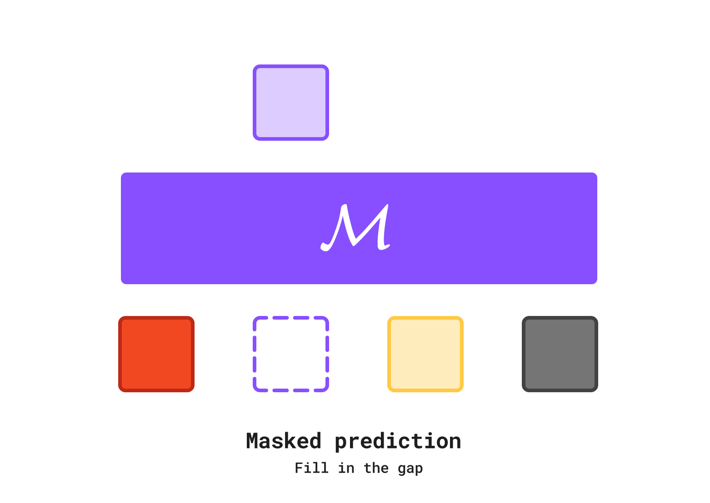
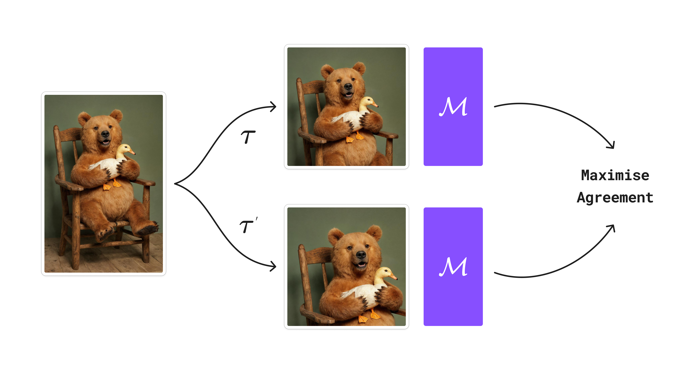
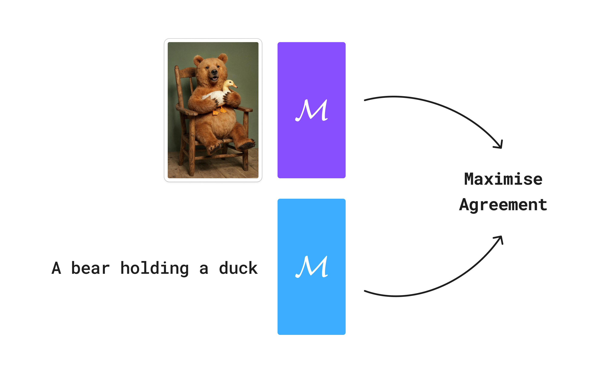
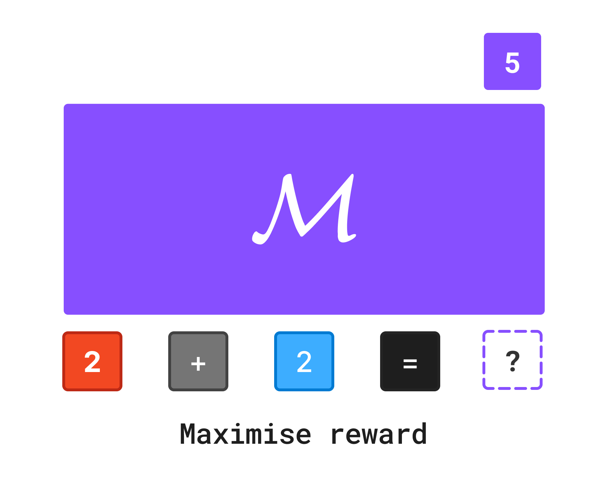
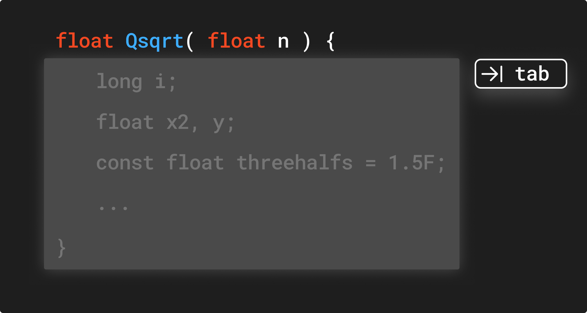
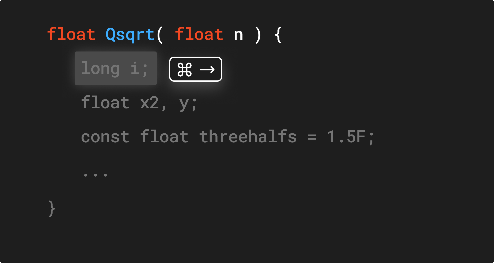
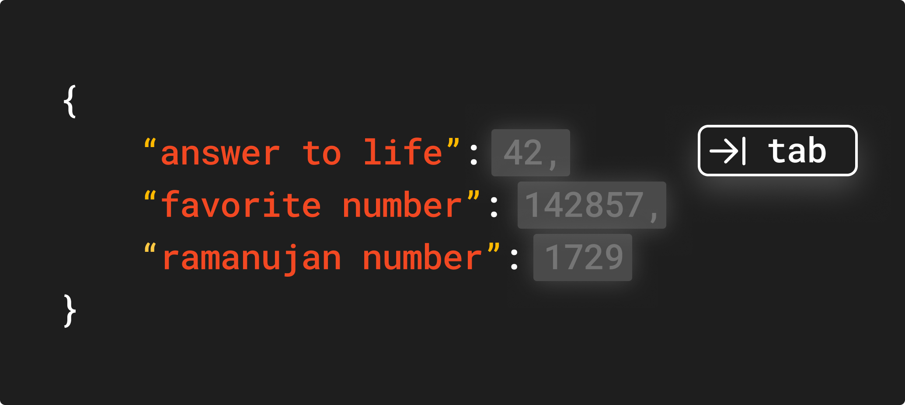
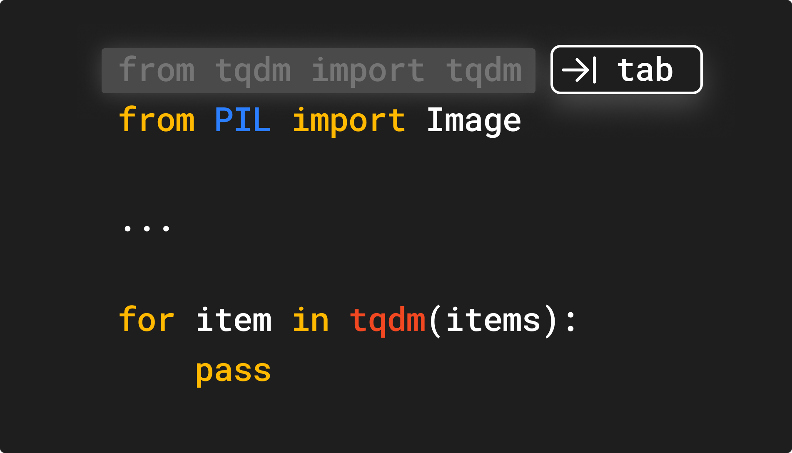

	

	Image generated using K1's unconditional distribution.

I usually write about my small projects. I've had a lot of unorganised thoughts, and writing them down helps me articulate them.
Also, it's been around a year since I graduated, worked at two startups, and launched my first model. I thought it's about time to reflect on how things are going.
In this post, I'll share some of my thoughts on research and how I approach it at a high level.

## Lessons learned

Here are the most important lessons I've learned over the last few years.

### Data is king

Algorithms are ephemeral, but data is eternal. Debugging ML code is notoriously difficult. There's no compiler and error messages that tell you what's wrong.
On the other hand, data is much easier to debug, much easier to scale, and much easier to improve. 
The best thing is that even if the current model training paradigm becomes obsolete the next day, any investment you have made in your data and data pipeline will still be useful.
From my experience, if you have a scalable training paradigm, investing in data has the highest return on investment.

### Evaluating research

How do you know if a research paper is good? Everybody has their own preferences. But here's how I've come to evaluate them.

1. **Is the method simple?**
2. **Is the method scalable?**
3. **Does it unlock new capabilities?**
4. **Does it make things go fast?**

Let's go through each of them in more detail.

#### Simplicity

Simplicity matters. Simple things work. Simple ideas permeate better. Most big advancements in ML came from simple ideas.
Going deeper with neural networks, normalisation, contrastive learning, residual connections, next token prediction, transfer learning, ...
Because I think this is such a core point, I'll illustrate it with a few examples.

#### Kaiming He

When you read Kaiming's work, you notice a few patterns.

1. His ideas are simple.
2. His papers require no more than basic undergraduate mathematics.
3. His methods are simple to implement.
4. His models actually work.

Good examples of this are [Residual Networks](https://openaccess.thecvf.com/content_cvpr_2016/html/He_Deep_Residual_Learning_CVPR_2016_paper.html), [PReLU](https://arxiv.org/abs/1502.01852) and
[Masked Autoencoders](https://openaccess.thecvf.com/content/CVPR2022/papers/He_Masked_Autoencoders_Are_Scalable_Vision_Learners_CVPR_2022_paper.pdf).
More recent works include [Did we need timestep conditioning?](https://arxiv.org/abs/2502.13129), [Transformers without normalisation](https://openaccess.thecvf.com/content/CVPR2025/papers/Zhu_Transformers_without_Normalization_CVPR_2025_paper.pdf), and [Meanflow](https://arxiv.org/abs/2505.13447).

For instance, there are many papers that propose few-step diffusion models at the pretraining stage. 
Notable methods that I can think of are [sCM](https://openai.com/index/simplifying-stabilizing-and-scaling-continuous-time-consistency-models/) and [IMM](https://arxiv.org/abs/2503.07565).
I'd encourage people to read both sCM and IMM and compare them to the Meanflow paper. The Meanflow paper only requires basic multivariable calculus, generalises flow matching models, and is much simpler to implement.
This is not to say that sCM and IMM are not good works. They are. But if you are to bet money on which method ends up being adopted over the next few years, I'd bet on Meanflow.

**Flow matching**

Flow matching is another excellent example. Let's be honest. Diffusion and score matching are not the easiest ideas to wrap your head around. Nor were they trivial to implement.
If I'm given a blank sheet of paper and asked to fully reproduce the EDM paper, I'm not too confident that I can do it. But if it was flow matching, I'd be pretty confident.
If I were to grab a random person on the street and ask them to code up an image generation model at home, which one would they choose?
Again, at the end of the day, diffusion, flow matching, score matching, ... have a unified framework and that's what makes it so beautiful. 
However, when it comes to making things work, we need to choose a method that has minimal room for error.

**Image editing**

Let's take another example. Image editing. 
There have been tons of research done on image editing quite recently, and we should reflect on what method ended up being most effective.
I can remember countless papers that tried to tackle image editing through [training](https://arxiv.org/abs/2411.14430) [free](https://rf-inversion.github.io/) approaches.
While these papers were interesting and novel, they seemed too complicated to me. In the end, the kinds of methods that won out were [Kontext](https://arxiv.org/abs/2506.15742), [Bagel](https://github.com/ByteDance-Seed/Bagel), and [UNO](https://arxiv.org/abs/2504.02160).
The core ingredient boiled down to (1) simple concatenation of reference image tokens and (2) focus on high quality image editing data.

	

	Kontext. Simple architecture. Minimal complexity. Easy to scale with more data.

Again, I don't blame the individual researchers because novelty is important for a paper to get published. 
GPUs to train models are not cheap. However, what I have learned over the last few years is that simple, elegant methods end up being the winners.

**Alec Radford**

When I think about Alec Radford's works, many of his core works follow a simple design. CLIP, GPT, Whisper are all simple methods that leveraged transformers and large quantities of data.
There are a lot of lessons to be learned when it comes to the development of CLIP. CLIP checks off almost all the boxes I find desirable in a research project.

1. CLIP is simple.
2. CLIP took almost a year to make it work. Persistence matters in research.
3. CLIP is scalable and leverages the power of data.
4. CLIP unlocked new capabilities and sparked a new wave in multimodal learning.
5. CLIP showed that data quality is king. [The community took several years to replicate OpenAI CLIP's data recipe](https://arxiv.org/abs/2309.16671).

#### New capabilities

I'm always excited to see when a paper comes out that unlocks a new capability. For me, the most inspiring moment was when I first saw GANs and realised that we now have algorithms that can not just understand images, but also generate them.
Image captioning, large language models, contrastive learning, reinforcement learning, multimodality, ... are all examples of how new paradigms and capabilities have created new frontiers for research.
Unlocking new capabilities is not only exciting, but also favorable from a product standpoint. Generative models are one of the most competitive industries in the world. Quality and performance are no longer enough to simply stay in the game.
Your model and product truly needs something unique that no other competitor has.

#### Scalability

Scalability goes hand in hand with the previous point. If your training method is scalable, you can throw more compute and more data at it.
Debugging ML code and making fundamental improvements in research is not a difficult problem. 
Maybe the "only" reliable way we found to improve model performance is compute and data. As my old professor used to say, "if it works, why fix it?".

#### Making things fast

Research is all about iteration. Most of my experiments fail. Iterating and burning through ideas and experiments is a core part of research.
Making things fast is desirable from a research perspective, but we have seen how being "fast" has unlocked new interactions and primitives.

Programming is a good example of this. If LLM inference was slow, we would not have seen an explosion of AI code editors and tools. Certain interactions are only possible with fast inference.
The same is true for image generation. [Realtime image generation](https://x.com/TitusTeatus/status/1879993056830849345) allows users to seamlessly iterate and interact with images.
Furthermore, because of the stochastic nature of generative models, iteration is a core part of the user experience.

Perhaps, Flash Attention was the first piece of technology that sparked the community to think more about efficiency.
I personally follow most papers that come out of [Hazy Research](https://hazyresearch.stanford.edu/) [^5]. 
They continue to build technologies for performance and efficiency in ML. Not to mention that they focus on practical applications.
Works that come out of Berkeley are also a close second.

### Engineering matters

During my undergraduate days, a consistent pattern that I found with many PhD students is that they don't write clean code. Research code is extremely messy.
One of the reasons why Huggingface's transformer library got so much traction was because it took fragmented, messy, and unorganised code and made it into a clean, well-documented, and easy to use library.
This is not the case in recent times. Good presentation, usability, and code quality are requirements if you want to get your work cited and used by the community.
ML research moves extremely fast and having the ability to understand and implement new methods has become critical. 
This is one of the reasons why I'm very opposed to premature abstraction unless a certain method has been rigorously tested and proven to be useful.

I believe this point has been iterated by many people, but I strongly believe that a __good researcher__ has to be a __good engineer__.
Machine learning is a young field and there are a lot of low hanging fruits that can come from simple, intuitive, and clever ideas. The meta of the game changes every few years and newcomers always have a chance to contribute.
While ideas are important, the zeitgeist of the last decade has been scaling models and scaling data. We need good distributed system designs and engineering to keep scaling our models.

	

	DoTA 2 distributed RL system.

Among many of OpenAI's works, I still find the [DoTA 2 paper](https://cdn.openai.com/dota-2.pdf) to be one of the most impressive ones. It used **a single layer 4096 unit LSTM with PPO** that was enough to beat the best human players.
Moreover, a lot of work went into designing an efficient distributed RL system. It goes to show that knowing how to build a good distributed system should not be overlooked, especially combined with the importance of iteration speed.

### Persistence

There are many aspects that make a good researcher. Systematic thinking. Good research taste. Mathematical maturity. Engineering skills. Iteration speed.
Engineering skill is now being recognised more and more as a core skill for a researcher. As people often say, it's easy to turn a good engineer into a good researcher, but not the other way around.
I think one characteristic that sometimes gets overlooked is how "painful" research can be. Research is about trying to make something that doesn't work... work.
There's no tutorial or guide to help you through the process. Most experiments and ideas fail. You can easily work on a problem for months, or even years and not get anywhere.
I've given CLIP as an example above. But if you think about it, the history of artificial intelligence and neural networks is a testament to the value of persistence.

A more recent example is diffusion models. Diffusion models in their earliest form go back to 2015 with [Sohl-Dickstein's work](https://arxiv.org/pdf/1503.03585).
And it took many years until the community took it seriously. 
A lot of these early research efforts were spearheaded by Stefano Ermon's group and Jonathan Ho's efforts[^1]. 
I believe it was only around 2021 when OpenAI published [Diffusion Models Beat GANs on Image Synthesis](https://arxiv.org/abs/2105.05233) that diffusion started gaining momentum.
Nowadays, everything moves so fast and the research cycle has become infused with the product cycle. I often complain about university and academia, but I truly believe that universities are the right place where long term research can thrive.
It's the place where multiple disciplines can come together and students have time to learn the fundamentals.

### Changing the objective

Many people praise the transformer architecture as the secret sauce that made modern deep learning possible. 
I think architectural research and innovation are important, but I believe that bigger innovations came when we changed the objective function for the neural network.
Let's consider the GPT paper. Transformers made next token prediction more scalable and efficient, but the driver of the innovation came from the next token prediction itself.

	

Another branch of language modeling that has a long history is masked prediction, which originates all the way back to [word2vec](https://arxiv.org/pdf/1301.3781) which used CBOW[^2] objective to learn a vector representation of words.
[BERT](https://arxiv.org/abs/1810.04805) and [MAE](https://arxiv.org/abs/2111.06377) are notable works that used masked prediction to learn text and image representations. 
In some cases, you can even use masked prediction for image generation as shown in a series of works by [Huiwen Chang](https://arxiv.org/abs/2202.04200)[^3].

	

Contrastive learning is another great example. SimCLR starts from a basic idea. You apply augmentation that doesn't alter the "core" of the image.
You then train a model to predict whether two images are the same or different. Pull similar things together and push different things away.

	

CLIP follows a similar idea, except you maximise agreement between text and image. 
CLIP is in contrast to SimCLR because SimCLR only requires images, but CLIP requires paired text and image data.

	

The innovations that led to ChatGPT are also in changing the objective function. 
Instead of asking the model to predict the next token, you can ask the model to produce a response that maximises an arbitrary reward function.

	

The core theme that appears again and again is how simple the prediction objective is. 
More importantly, none of the objective functions force an inductive bias. 
Next token prediction is a canonical example because it doesn't force any inductive bias. We don't force the model to be better at grammar, knowing specific facts, ...
[To get better at predicting the next token, you naturally acquire these skills](https://www.youtube.com/watch?v=kYWUEV_e2ss) [^4]. It's similar to raising a child. 
You shouldn't force them to be great, but create an environment that allows them to be great. 
That's why I often find [auxiliary](https://arxiv.org/abs/2502.14786) [losses](https://arxiv.org/abs/2012.09841) [to](https://arxiv.org/abs/2410.06940) [be](https://arxiv.org/abs/2502.02492) [deeply](https://arxiv.org/abs/2304.07193) [dissatisfying](https://arxiv.org/abs/2408.15664).
I find myself implementing auxiliary losses in my research because it works and gets the job done. Even in cases where it's successful, it feels like a hack.

### Almost everything are averages

I recently found this fact quite funny.

- Attention is a weighted average
- Flow matching model predicts averages
- In fact, most models predict averages
- Gradients are averaged across multiple samples.
- Gradients are averaged across GPUs
- Gradients are averaged across nodes
- EMA is averaging
- Model merging is averaging
- Batchnorm / Layernorm / Groupnorm are averaging
- Adam averages gradients

### How much mathematics do you need for ML research?

You need it as much as you need it. A good grasp on linear algebra and multivariable calculus is needed.
Probability theory and statistics are also useful to have. Anything beyond that I find optional depending on the research topic. Just learn it as you need it.
For diffusion models, some mathematical maturity was needed, but with the introduction of flow matching, the barrier to entry has been lowered.

### Bootstrapping research

Even when you start your research, one thing you should keep at the back of your mind is whether this would be something useful for your next research down the line.
CLIP model can be used to come up with better data to train your next CLIP. LLMs can be used to generate better synthetic data. [GAN discriminator can be used to get better GAN data](https://gwern.net/face#faces-preparation).
Trying to develop a model that can provide these compounding returns is something worth thinking about.

### Product and research

We are still at a very experimental stage of generative models. We are seeing early applications of how generative models can unlock new interactions and primitives.
Research should provide a foundation for unique user experience in the product; and product should help shape what type of research is needed. Code assistance is a good example.
In the early days, the simplest primitive was right to left completion.

	

	Right to left completion. Tabnine and Github Copilot are the ones that popularised this primitive.

Even with this simple primitive, there are a few interesting technical challenges. The latency of the model has to be almost realtime to enable seamless interaction.
Moreover, a naive implementation occludes the model from seeing the later part of the code. Another feedback that was given at this stage was that accepting partial results was not possible.
You had to either accept the entire completion or nothing. Partial acceptance was added to Github Copilot later for this reason.

	

	Github Copilot soon added partial acceptance.

What followed were "edit" primitives that went beyond simple right to left completion. Cursor's "edit" feature that allows you to apply smart edits to your code is a good example.

	

	Cursor's "multiline edit" feature.

Edit and completion are interesting by themselves, but programmers often need to navigate between different parts of the code. This is where the "jump" primitive comes in.
ML engineering and research naturally blend together to power these primitives [^7] [^8] [^9].

	

	Cursor's "jump" feature. It navigates you to the location of the code you want to edit next.

Product provides a source of inspiration for practical research directions, but also serves as a source of training environment. In the context of code assistants, acceptance rate can be used as a proxy for reward function.
You can also roll out different models and generations to mine preference data. What's interesting is that generative models have a parallel with recommendation systems.
At the end of the day, code assistants are recommending code edits to the user just as Netflix recommends movies to the user. 
A lot of generative model applications still lack the level of personalisation that existing recommendation systems have. Ideally, you don't have to write a long list of rules to guide the completion of the assistant.
It should be able to infer your preference from seeing the code you write.

One of the reasons why I enjoy working at [Krea](https://www.krea.ai/) is that it's one of the very few companies where we can jointly design the product and research. I'm quite excited to build out generative models that better understand user preferences.
**Older recommendation systems simply "retrieved" existing content we think that the user would like. Now, imagine having a model that can "generate" content to the user's liking on the fly.**
Image and Video models are in a very exploratory stage. Except for scattered hyperspecific applications, image and video models have not yet penetrated the mainstream market like the way LLMs have.
There are still many primitives and UX problems that need to be solved for image and video models. It's an exciting time to be working in this space.

Lastly, the practical aspect of product cannot be overlooked. ML research is **expensive**. GPUs don't grow on trees[^6]. You need an infinite money printer to train foundation models. A stable revenue stream is needed at the very least.
OpenAI and Anthropic are rare cases where they have found a good product to fund their research. However, it should be noted that OpenAI was very much a Manhattan project. We should also remember that even they struggled to find their footing in early days.
It's no surprise that Google and Meta are the ones that have some of the best research teams. They are companies that already have an infinite money printer and expertise in building out large scale distributed data systems.

[^1]: not to mention that DDPM formulation is very helpful when trying to apply RL to diffusion.
[^2]: given the surrounding words, predict the missing word.
[^3]: she was the initial pioneer in using masked prediction for image generation and [major contributor to gpt-4o image generation](https://x.com/SuhailAhmad/status/1939987911555825806).
[^4]: again, it's important to note that next token prediction combined with internet scale data is a powerful combination. if you train a model to predict the next token for gibberish, it will not work.
[^5]: I really like [ThunderKittens](https://hazyresearch.stanford.edu/blog/2024-05-12-quick-tk) and their recent [Cartridges paper](https://hazyresearch.stanford.edu/blog/2025-06-08-cartridges).
[^6]: Although, I wish they did.
[^7]: [Speculative decoding](https://arxiv.org/abs/2211.17192)
[^8]: [Rewrite problem](https://fireworks.ai/blog/cursor#rewrite-problem)
[^9]: [Teaching LLMs to fill in the middle](https://arxiv.org/abs/2207.14255)