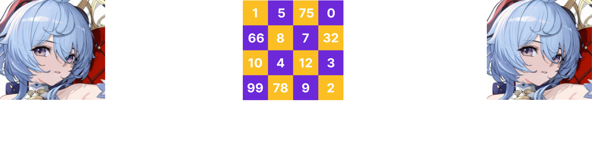
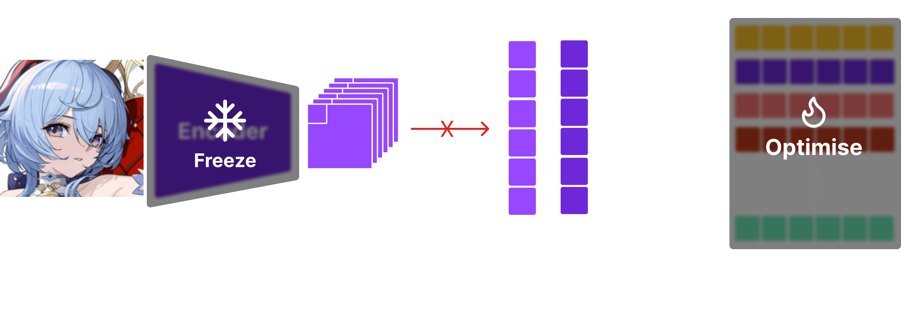
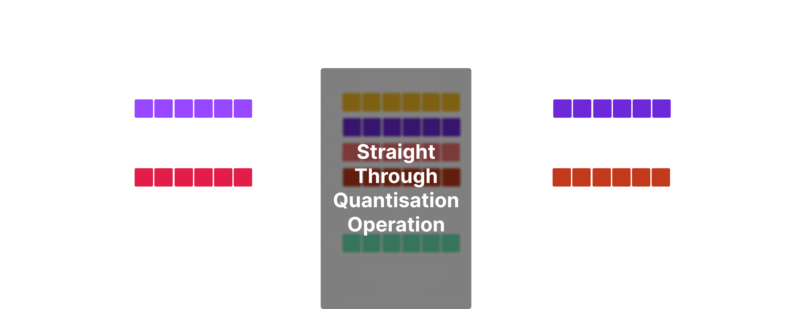

import { Image } from "astro:assets"
import modeling from "./images/vqgan/modeling.svg"
import l2 from "./images/vqgan/l2.svg"
import mode from "./images/vqgan/mode.png"
import teaser from "./images/vqgan/teaser.png"
import grid from "./images/vqgan/grid.png"
import fix from "./images/vqgan/fix.png"

## Overview

VQVAE [1] and VQGAN [2] are essential components of training latent diffusion models as well as autoregressive models.
In this post, I will be sharing a few insights into training VQGAN on the animefaces dataset.
It's been a while since I've trained VQGAN on the animefaces dataset and there's been many new improvements such as the Mamba backbone [3], FlashAttention [4], and the torch.compile features I haven't had the chance to explore in detail. There are a few structural changes I've made to the VQGAN architecture, but here are some of the key takeaways:

<div className="my-12">

- **Convolution** backbone outperforms **Attention** and **Mamba** backbones.
- **Bidirectional Mamba** backbone outperforms standard **attention** backbones.
- Using overlapping patches and extra convolutional layers can help "smooth out" the generated images for Transformer / Mamba backbones.

</div>

<div className="my-12 w-2/3">
## Table of contents

- [Background](#background)
- [Training VQVAE](#training-vqvae)
  - [Training the codebook](#training-the-codebook)
  - [Training the encoder and decoder](#training-the-encoder-and-decoder)
  - [Additional losses](#additional-losses)
- [Training the full model](#training-the-full-model) ← Skip to here if you're already familiar with VQVAE

</div>

<h2 id="background">Background</h2>

What is a VQGAN and VQVAE in the first place? And why are they important?
VQVAE [1] has been around for a quite long time since 2017. It is an autoencoder (i.e. compresses and decompresses data), but with a key twist: it uses a discrete latent space. In layman's terms, it means that:

> VQVAE can compress data into "tokens" and then decompress it back into the original data.

<div className="center my-8 p-2"></div>

The advantage of this approach is that instead of learning directly on "uncompressed" data which would require a lot of memory and computation, we can learn on the compressed tokens which are much smaller in size.
Prior works such as PixelSNAIL and ImageGPT were directly trained on "pixels" which made it difficult to generalise to high resolution images. But, with VQVAE, we can train on the compressed tokens and then decompress it back into the original data.
One may still ask "why not just use a normal autoencoder?" The key difference is that VQVAE uses a "discrete" latent space which allows us to model the data as if they are "tokens".

<div className="center my-8 p-2">
	<Image src={modeling} alt="modeling" />
</div>

This is good news for us since we can apply all the tricks from language modeling to images. For instance, we can train a minigpt model on the tokens to autorergressively generate images.
This approach was explored in the VQGAN paper [2] where the authors trained an autoregressive transformer models to generate images from the compressed tokens.

Sure, but how do you actually "quantise" a vector? We use a codebook! A codebook is simply a set of "vectors". When we quantise a vector, we find the closest vector in the codebook and use that as the quantised vector. This is the core idea behind VQVAE and VQGAN. To be explicit, this is how quantisation in VQVAE works:

<div className="center my-8 p-2"></div>

Firstly, we use an encoder to compress and extract its features. For example, if we have an image of shape $256 \times 256 \times 3$, using a backbone of your choice, we can compress it into a tensor of shape $16 \times 16 \times 768$, which gives us $16 \times 16 = 256$ vectors of size $768$. For each of these $256$ vectors, we find the closest vector in the codebook and use that as the quantised vector.

<div className="center my-8 p-2"></div>

Notice here that the codebook gives two important outputs: the quantised vector from a "fixed" set of vectors and the "index" of the vector in the codebook.
We can effectively use the "index" as a "token" to train autoregressive models.

<div className="center my-8 p-2"></div>

Finally, we use a decoder to reconstruct the original image from the quantised vectors. Now, we have a basic understanding of how vector quantisation and VQVAE works. But, the question remains: how do we train these models?

<div className="text-sm opacity-50 my-4">
	**Note**:
    I could go into more detail about the VQVAE and VQGAN, but for purpose of this post, I've kept this section short. VAE was
    originally introduced by Kingma and Welling in 2013 which introduced core concepts such as the reparameterisation trick and
    ELBO. VQVAE was a followup work by Oord et al. to address the problem of posterior collapse and open up possibilities for
    autoregressive models. For a more detailed explanation, I recommend reading [Lilian Weng's blog
    post](https://lilianweng.github.io/posts/2018-08-12-vae/) on VAEs and the original papers!

</div>

<h2 id="training-vqvae"> Training VQVAE</h2>

To train a VQVAE, there are three components we need to train: the encoder, the quantiser, and the decoder.
Our objective is to:

- Train a codebook that can effectively quantise the data.
- Compress and decompress the data without losing too much information.

Let's tackle these problems one by one.

<h3 id="training-the-codebook">Training the codebook</h3>

To train the codebook, we want the **codebook** and the **encoder** to work together to effectively quantise the data.
In other words, we want the **encoder's output** and the **codebook's vectors** to be close to each other.
There are two ways to do this: **straight-through estimator** and **gumbel softmax**. In this article, I'll be using the **straight-through estimator** since it's eaiser to implement and more widely used.

Since we want the encoder's output and the codebook's vectors to be close to each other, we have two options.

- We can make the encoder's output close to the codebook's vectors. This is known as the **commitment loss**.
- We can make the codebook's vectors close to the encoder's output. This is known as the **VQ loss**.

<div className="center my-8 p-2"></div>

**Commitment loss** is simply the L2 loss between the encoder's output and the codebook's vectors. Mathematically, it can be written as:

$$
\mathcal{L}_{\text{commit}} = \|\text{sg}[z_q] - z_e\|_2^2
$$

where $z_e$ is the encoder's output, $z_q$ is the quantised vector (i.e. the closest vector in the codebook), and $\text{sg}[\cdot]$ denotes the `stop_gradient` operator.

<div className="center my-8 p-2">
	
	<p className="opacity-50">Figure - Commitment loss between the encoder's output and the codebook's vectors.</p>
</div>

It's important that we use the `stop_gradient` operator (`.detach()` in PyTorch, `.stop_gradient()` in JAX) to the codebook vector $z_q$ since we want to treat it as a constant. This way, the parameters of the encoders are updated to make the encoder's output close to the codebook's vectors.
One way to think about this is that you're training the encoder to "commit" to a specific vector in the codebook, instead of switching between different vectors.

<div className="center my-8 p-2"></div>

Vice versa, the **VQ loss** is defined similarly, but with `stop_gradient` applied to the encoder's output.

$$
\mathcal{L}_{\text{vq}} = \|\text{sg}[z_e] - z_q\|_2^2
$$

Since the codebook is typcially initialised with $\mathcal{N}(0, 1)$, it's beneficial to introduce VQ loss such that the codebook vectors are pulled closer to the distribution of the encoder's output. It also makes encoder's task slightly easier since codebook vectors are drawn closer to the encoder's output.
To optimise these objectives jointly, we simly take the sum of the two losses, yielding the final objective for the codebook:

$$
\mathcal{L}_{\text{codebook}} = \|\text{sg}[z_q] - z_e\|_2^2 + \beta \|\text{sg}[z_e] - z_q\|_2^2
$$

where $\beta$ is the hyperparameter that controls the tradeoff between the two losses.
It's been shown that $\beta = 0.25$ works well in practice [1].

<h3 id="training-the-encoder-and-decoder">Training the encoder and decoder</h3>

Now, that we have an idea of how to train the codebook, let's move on to training the encoder and decoder.
In a typical autoencoder setup, all the components of the network are continous differentiable operations (linear layers, activations, etc.). However, in VQVAE, we clearly have a non-differentiable operation: the quantisation step.

> All differentiable functions are continous, so discontinous functions (`max`, `random sampling`, `quantisation`, ...) are non-differentiable. In these cases, we need to define a custom gradient for the non-differentiable operation.

In straight-through estimator, we use the following neat trick:

<div className="p-4 my-4">

```python
def straight_through_quantisation(x):
	return x + (quantise(x) - x).detach()
```

</div>

The output of `straight_through_quantisation` is `quantise(x)`. But, we notice that `quantise(x) - x` is effectively a "constant" since we apply `detach` to it.
Hence, when backpropgation is performed, the gradient of `quantise(x)` is effectively the gradient of `x`. i.e. we have "taped" the gradient of `x` to `quantise(x)`.

<div className="center my-8 p-2"></div>

Using this trick, we can allow the encoder and decoder to be trained end-to-end to optimise the reconstruction loss.

$$
\mathcal{L}_{\text{r}} = \|\text{decoder}(\text{quantise}(\text{encoder}(x))) - x\|_2^2
$$

In layman's terms, we want the reconstructed image to be close to the original image.

<h3 id="additional-losses">Additional losses</h3>

There are two common losses that are used in VQVAE training: **perceptual loss** and **GAN loss**.
Perceptual loss is typically implemented by computing the L2 loss between latent features of a pretrained network (e.g. VGG, Resnet, etc.).
Perceptual loss is designed to capture how "perceptually similar" the reconstructed image is to the original image.

GAN loss is implemented by training a discriminator to distinguish between the original image and the reconstructed image.
GANs [5] were originally developed to generate images, but they have been also adapted into many superresolution [6] and image reconstruction tasks. Ok, but **why do we care about perceptual loss and GAN loss**?

The limitation of simple L2 loss is that it's agnostic to aspects such as "sharpness", "texture", and "structure" of the image.
For instance, under L2 loss, all the surrounding images have the same l2 distance compared to the image in the center.

<div className="center my-8 w-full p-2">
	<Image className="w-1/3" src={l2} alt="l2" />
	<p className="my-2 text-sm opacity-50"> All the surrounding images have the same l2 distance!</p>
</div>

When training any generative model, one pitfall is that the model can get away by generating "average" of all the images in the dataset.
For instance, below is an example of a model that fell into this local minima of **animefaces** dataset.

<div className="center my-8 p-2">
	<Image className="w-2/3" src={mode} alt="mode" />
	<p className="opacity-50">When your neural network takes the easy way out...</p>
</div>

Both GAN loss and perceptual loss are designed to address this issue. Perceptual loss can help capture the "structure" and "texture" of the image. Especially, GAN loss has been found to be effective in generating "sharp" and "realistic" images as shown in super resolution literature [6].

<h2 id="training-the-full-model">Training the full model</h2>

For my setup of training VQVAE, I used the following configuration:

- **Image size**: $256 \times 256$
- **No GAN loss**: I found that perceptual loss (`LPIPS` with `vgg` backbone) was sufficient to generate sharp images
- **Loss**: $\mathcal{L} = \mathcal{L}_{\text{codebook}} + \mathcal{L}_{\text{r}} + 0.1 \times \mathcal{L}_{\text{perceptual}}$
- **$\beta = 0.25$**: Seemed to work well out of the box
- **AdamW optimiser**: `lr = 3e-4, betas=(0.9, 0.95), weight decay=0.05`
- **Linear warmup**: 1024 steps.
- **Batch size**: 16 with 8 accuumlation steps.
- **torch.compile**: Use it. It's good.
- **SDPA**: for fast attention.
- **GPU**: Single A6000 (48GB VRAM)
- **Precision**: bfloat16
- **Augmentations**: `RandomCrop(scale=(0.8,1.0))`, `RandomHorizontalFlip(p=0.3)`, `RandomAdjustSharpness(2,0.3)`, `RandomAutocontrast(0.3)`

Architectally, I used the following setup:

- **Number of codebook vectors**: 16384
- **Codebook dimension**: 16
- **l2 normalised codes**
- **SwiGLU** for MLP layer
- **RMSNorm** for normalisation
- **Patch size**: 8x8

It's been found that using a large codebook size with a small codebook dimension and l2 normalised codes improves codebook usage and reconstruction quality [7][8].
The main research question is whether Mamba, Attention, or Convolution backbones are better for VQVAE training.

<h3 id="convolution-backbone">Convolution backbone</h3>

Apart from a few exceptions [7][9], most works use a CNN backbone for VQVAE training. I used a standard ConvNext [10] backbone design.
To match the token count of Mamba and Transformer backbones, I downsample the image to $32 \times 32$ resolution. I also added a transformer layer before/after the quantiser. At each resolution (256, 128, 64, 32), I used two ConvNext blocks. The architecture of ConvNext block is as follows:

<div className="p-4 my-4">

```python
class NeXtformer(nn.Module):
    def __init__(self, features:int):
        super().__init__()
        self.depthwise = nn.Conv2d(features, features, 7, padding=3, groups=features)
        self.prenorm = RMSNorm(features)
        self.postnorm = RMSNorm(features)
        self.mlp = SwiGLU(features, bias=False)

    def forward(self, x):
        x = self.depthwise(self.prenorm(x)) + x
        x = self.mlp(self.postnorm(x)) + x

        return x
```

</div>

<h3 id="attention-backbone">Attention backbone</h3>

ViT-VQGAN [9] was one of the first works to explore the use of attention backbones for VQVAE training (also introduced l2 normalised codes).
I closely replicated the architecture from the paper.

<div className="p-4 my-4">

```python
class VQVAE(nn.Module):
    def __init__(self, features:int=768, ...):
        super().__init__()
        self.size = size
        self.patch = patch
        self.strides = strides

        self.ntoken = (size // strides)
        self.epe = WPE(features, self.ntoken ** 2)
        self.dpe = WPE(features, self.ntoken ** 2)

        # patchify
        self.input = nn.Conv2d(3, features, patch, ...)

        # encoder
        transformers = [Transformer(features, ...) for _ in range(depth)]
        self.encoder = nn.Sequential(*[
			*transformers, RMSNorm(features),
			nn.Linear(features, 4 * features),
			nn.Tanh(), nn.Linear(4 * features, features)
		])

        # quantiser
        self.quantiser = VectorQuantiser(features, codes, pages)

        # decoder
        transformers = [Transformer(features, ...) for _ in range(depth)]
        self.decoder = nn.Sequential(*[
			*transformers, RMSNorm(features),
			nn.Linear(features, 4 * features),
			nn.Tanh(), nn.Linear(4 * features, features)
		])

        # unpatchify
        self.output = nn.ConvTranspose2d(features, 3, ...)

    def forward(self, x):
        x = rearrange(self.input(x), 'b c h w -> b (h w) c')

        x = self.encoder(self.epe(x))
        codes, loss, idxes = self.quantiser(x)
        x = self.decoder(self.dpe(codes))

        x = rearrange(x, 'b (h w) c -> b c h w', h=self.ntoken, w=self.ntoken)
        x = self.output(x)

        return x, loss, idxes
```

</div>

<h3 id="mamba-backbone">Mamba backbone</h3>

For Mamba backbone, I simply used the same architecture as ViT-VQGAN, but with attention layer swapped with Mamba layer.
I tried to variants of Mamba: standard Mamba and bidirectional Mamba.

<div className="p-4 my-4">

```python
class SSD(nn.Module):
    def __init__(self, features:int, heads:int, bias=False):
        super().__init__()
        self.mamba = Mamba2(features)
        self.prenorm = RMSNorm(features)
        self.postnorm = RMSNorm(features)
        self.mlp = SwiGLU(features)

    def forward(self, x):
        x = self.mamba(self.prenorm(x)) + x
        x = self.mlp(self.postnorm(x)) + x

        return x

# simple bidirectional mamba similar to Bidirectional LSTM
class BSSD(nn.Module):
    def __init__(self, features:int, heads:int, bias=False):
        super().__init__()

        self.fwd = Mamba2(features)
        self.bwd = Mamba2(features)

        self.prenorm = RMSNorm(features)
        self.fwdnorm = RMSNorm(features)
        self.bwdnorm = RMSNorm(features)

        self.fwdmlp = SwiGLU(features)
        self.bwdmlp = SwiGLU(features)

    def forward(self, x):
        # b t d
        f = x
        b = torch.flip(x, dims=[1])

        f = self.fwd(self.prenorm(f)) + f
        f = self.fwdmlp(self.fwdnorm(f)) + f
        b = self.bwd(self.prenorm(b)) + b
        b = self.bwdmlp(self.bwdnorm(b)) + b

        # flip back
        b = torch.flip(b, dims=[1]) # <- important

        return f + b
```

</div>

It's important to note that **you flip back `b`**. Otherwise, the model would spend most of the time learning how to reverse the input sequence.

### Preliminary results

For benchmarking, I've used models of following sizes:

- **Convolution**: 16M
- **Attention**: 36M
- **Mamba**: 33M
- **Bidirectional Mamba**: 33M

An initial comparison of the three backbones reveals that CNN is a clear winner despite having the fewest parameters.
Another suprising result was that bidirectional Mamba and standard Mamba performed similarly. Hence, it's not clear whether bidirectionality helps.
Works such as VIM [11] have used bidirectional modeling for Mamba backbone, but recent work such as MambaVision [12] simply uses concatenation of SSD features and gated features to achieve better performance.

<div className="center my-8 p-2">
	
	<p className="opacity-50">CNN backbone outperforms Attention and Mamba backbones</p>
</div>

One major difference between the CNN backbone and the others is that the `compress` (codebook loss) tends to converge very smoothly.
Another noticible difference is that CNN backbones have a better initialisation.

<div className="center my-8 p-2">
	<Image src={teaser} alt="teaser" />
	<span className="my-2 text-center opacity-50">
		Comparison of reconstructions and initialisation for different VQVAE backbones. <br />
		**Left: Original / Reconstructed image at initialisation. Right: Original / Reconstrcuted image after 30K steps.**
	</span>
</div>

CNN's initialisation is noisy, but resembles the original image. On the other hand, Mamba and Attention backbones mostly output a grid-like noise pattern.
These "grid" artifacts persist throughout the training.

<div className="center my-8 p-2">
	<Image className="w-2/3" src={grid} alt="grid" />
	<p className="opacity-50">Grid artifacts in Mamba and Attention backbones</p>
</div>

To fix this issue, I had two ideas in mind:

- **Overlapping patches**: Instead of using non-overlapping patches, we can use overlapping patches to "smooth out" the generated images.
- **Extra convolutional layers**: We can use extra convolutional layers for extra "smoothing".

To overlap the patches, I simply add extra padding and increase kernel's size on input Conv2d and output ConvTranspose2d layers.
For extra convolutional layers, I've added a single 3x3 Conv2d layer as a final layer so that it can learn take care of the grid artifacts.

<div className="center my-8 p-2">
	<Image className="w-2/3" src={fix} alt="fix" />
	<p className="opacity-50">Fixing grid artifacts with overlapping patches and extra convolutional layers</p>
</div>

From the experiments, it seems that adding extra convolutional layers and overlapping patches does help out with the performance.
However, it's still nowhere close to the performance of the CNN backbone.

### Limitations and future work

It should be noted that I have not performed no comprehensive hyperparameter search or ablation studies.
I'm only a person with a handful of A6000 GPUs and running these experiments as a hobby.
Although, I'm interested in applying $\mu P$ [14] and Katie et al. [15] for fast hyperparameter search.

As previously mentioned, bidirectionality doesn't seem to help much. I'm currently running a modified version of MambaVision [13] which uses SSD [16] instead of SSM [3] for better performance. (Their performance is not looking good for your record, story for another day).
But, the obvious next step I want to take is to train an autoregressive model on top of CNN VQVAE using Mamba.

## References

- [1] Oord, Aaron van den, Oriol Vinyals, and Koray Kavukcuoglu. 2018. “Neural Discrete Representation Learning.” doi:10.48550/arXiv.1711.00937.
- [2] Esser, Patrick, Robin Rombach, and Björn Ommer. 2021. “Taming Transformers for High-Resolution Image Synthesis.” doi:10.48550/arXiv.2012.09841.
- [3] Gu, Albert, and Tri Dao. 2024. “Mamba: Linear-Time Sequence Modeling with Selective State Spaces.” doi:10.48550/arXiv.2312.00752.
- [4] FlashAttention. https://github.com/Dao-AILab/flash-attention (July 21, 2024).
- [5] Goodfellow, Ian J., Jean Pouget-Abadie, Mehdi Mirza, Bing Xu, David Warde-Farley, Sherjil Ozair, Aaron Courville, and Yoshua Bengio. 2014. “Generative Adversarial Networks.” doi:10.48550/arXiv.1406.2661.
- [6] Ledig, Christian, Lucas Theis, Ferenc Huszar, Jose Caballero, Andrew Cunningham, Alejandro Acosta, Andrew Aitken, et al. 2017. “Photo-Realistic Single Image Super-Resolution Using a Generative Adversarial Network.” doi:10.48550/arXiv.1609.04802.
- [7] Yu, Jiahui, Xin Li, Jing Yu Koh, Han Zhang, Ruoming Pang, James Qin, Alexander Ku, et al. 2022. “Vector-Quantized Image Modeling with Improved VQGAN.” doi:10.48550/arXiv.2110.04627.
- [8] Yu, Lijun, José Lezama, Nitesh B. Gundavarapu, Luca Versari, Kihyuk Sohn, David Minnen, Yong Cheng, et al. 2024. “Language Model Beats Diffusion -- Tokenizer Is Key to Visual Generation.” doi:10.48550/arXiv.2310.05737.
- [9] Lee, Doyup, Chiheon Kim, Saehoon Kim, Minsu Cho, and Wook-Shin Han. 2022. “Autoregressive Image Generation Using Residual Quantization.” doi:10.48550/arXiv.2203.01941.
- [10] Liu, Zhuang, Hanzi Mao, Chao-Yuan Wu, Christoph Feichtenhofer, Trevor Darrell, and Saining Xie. 2022. “A ConvNet for the 2020s.” doi:10.48550/arXiv.2201.03545.
- [11] Zhu, Lianghui, Bencheng Liao, Qian Zhang, Xinlong Wang, Wenyu Liu, and Xinggang Wang. 2024. “Vision Mamba: Efficient Visual Representation Learning with Bidirectional State Space Model.” doi:10.48550/arXiv.2401.09417.
- [12] Dao, Tri, and Albert Gu. 2024. “Transformers Are SSMs: Generalized Models and Efficient Algorithms Through Structured State Space Duality.” http://arxiv.org/abs/2405.21060 (June 3, 2024).
- [13] Hatamizadeh, Ali, and Jan Kautz. 2024. “MambaVision: A Hybrid Mamba-Transformer Vision Backbone.” http://arxiv.org/abs/2407.08083 (July 21, 2024).
- [14] “Microsoft/Mup.” 2024. https://github.com/microsoft/mup (July 18, 2024).
- [15] Everett, Katie, Lechao Xiao, Mitchell Wortsman, Alexander A. Alemi, Roman Novak, Peter J. Liu, Izzeddin Gur, et al. 2024. “Scaling Exponents Across Parameterizations and Optimizers.” doi:10.48550/arXiv.2407.05872.
